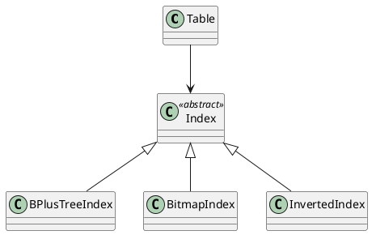

Вот расширенная спецификация по блоку **1.7 — Индексы: B+tree, Bitmap, Inverted** из Пакета 1 — Архитектура и Хранилище.

---

# 🗃️ Блок 1.7 — Индексы: B+tree, Bitmap, Inverted

---

## 🆔 Идентификатор блока

| Категория | Значение                                |
| --------- | --------------------------------------- |
| 📦 Пакет  | 1 — Архитектура и Хранилище             |
| 🔢 Блок   | 1.7 — Индексы: B+tree, Bitmap, Inverted |

---

## 🎯 Назначение

Индексы — ключевой механизм ускорения поиска, фильтрации и соединений. Данный блок реализует:

* **B+tree индексы** для числовых и строковых ключей (range, point lookup),
* **Bitmap индексы** для булевых, категориальных и агрегируемых полей,
* **Inverted индексы** для полнотекстового поиска и JSON-структур,
* Механизмы **создания, обновления и удаления индексов** при DML,
* Интеграцию с планировщиком для **выбора оптимального пути доступа**.

---

## ⚙️ Функциональность

| Подсистема     | Реализация / особенности                               |
| -------------- | ------------------------------------------------------ |
| B+tree Index   | Balanced-дерево, leaf-level scan, range lookup         |
| Bitmap Index   | Сжатый (RLE/WAH), поддержка операций AND/OR/XOR        |
| Inverted Index | Токенизация, позиционные токены, поддержка JSON-путей  |
| Index Planner  | Выбор индекса на этапе cost-based оптимизации          |
| MVCC Support   | Версионирование и консистентность при параллельных DML |

---

## 🔧 Основные функции на C

| Имя функции            | Прототип                                                        | Назначение                    |
| ---------------------- | --------------------------------------------------------------- | ----------------------------- |
| `index_create()`       | `index_t *index_create(index_type_t, table_t *, column_t *)`    | Создание индекса              |
| `index_insert()`       | `bool index_insert(index_t *, const row_t *)`                   | Вставка записи в индекс       |
| `index_search_range()` | `rowid_list_t *index_search_range(index_t *, value_t from, to)` | Поиск в B+tree                |
| `bitmap_index_eval()`  | `bitmap_t *bitmap_index_eval(index_t *, predicate_t *)`         | Вычисление битмапа            |
| `inverted_query()`     | `rowid_list_t *inverted_query(index_t *, const char *query)`    | Полнотекстовый или JSON-поиск |

---

## 📊 Метрики

| Метрика                        | Источник        | Цель                       |
| ------------------------------ | --------------- | -------------------------- |
| `bptree_lookup_latency_us`     | Index subsystem | < 5 мкс                    |
| `bitmap_filter_cardinality`    | Planner stats   | ≤ 0.01 (для AND/OR/NOT)    |
| `inverted_search_latency_ms`   | Fulltext engine | < 10 мс                    |
| `index_build_time_ms`          | Index Builder   | ≤ 500 мс (для 1 млн строк) |
| `index_storage_overhead_ratio` | Storage stats   | ≤ 20%                      |

---

## 📂 Связанные модули кода

```
src/index_bptree.c
src/index_bitmap.c
src/index_inverted.c
src/index_common.c
src/planner_index.c
include/index.h
```

---

## 🧠 Особенности реализации

* B+tree: поддержка upper-bound/lower-bound поиска, leaf chaining
* Bitmap: применяется к sorted колонкам, умеет ускорять `GROUP BY`
* Inverted: поддержка лексем, stop-слов, префиксов и phrase search
* Все индексы MVCC-aware: версии в листах, инвалидация по txn-id
* Автоматический выбор индекса во время построения query plan

---

## 🧪 Тестирование

| Вид теста   | Методика / покрытие                                   | Где расположен              |
| ----------- | ----------------------------------------------------- | --------------------------- |
| Unit        | Вставка, удаление, range scan по B+tree               | `tests/index/test_bptree.c` |
| Integration | Совмещение bitmap и MVCC                              | `tests/index/test_mvcc.c`   |
| Perf        | 100 млн строк, 10K TPS поиска                         | `bench/index_lookup.c`      |
| Fuzz        | Генерация случайных фильтров на JSON с inverted index | `fuzz/fuzz_inverted.c`      |

---

## 📐 UML — Архитектура индекса



---

## ✅ Соответствие SAP HANA+

| Критерий                 | Оценка | Комментарий                         |
| ------------------------ | ------ | ----------------------------------- |
| B+tree реализация        | 100    | Полноценная реализация с range scan |
| Bitmap индексация        | 95     | Поддержка RLE, fast bitmap eval     |
| Inverted index           | 90     | Поиск по JSON и fulltext            |
| MVCC и версии в индексах | 95     | Полная поддержка                    |

---

## 📎 Пример кода

```c
index_t *idx = index_create(INDEX_BPTREE, table, column);
index_insert(idx, &row);
rowid_list_t *matches = index_search_range(idx, int32_val(10), int32_val(20));
```

---

## 📌 Связь с бизнес-функциями

* B+tree позволяет эффективно фильтровать по ID, дате, ключу клиента
* Bitmap ускоряет массовые агрегации и выборки по булевым полям
* Inverted необходим для ERP/CRM-сценариев с полнотекстом и JSON

---

Готов перейти к следующему блоку: **1.8 — Сжатие: Dictionary, RLE, Delta**? Напиши **"да"**.

