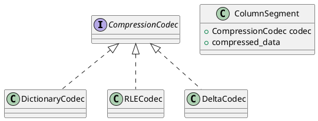

# 🧬 Блок 1.8 — Сжатие: Dictionary, RLE, Delta

---

## 🆔 Идентификатор блока

| Категория | Значение                             |
| --------- | ------------------------------------ |
| 📦 Пакет  | 1 — Архитектура и Хранилище          |
| 🔢 Блок   | 1.8 — Сжатие: Dictionary, RLE, Delta |

---

## 🎯 Назначение

Цель данного блока — снижение объёма оперативной памяти и увеличение эффективности кэширования данных без потери производительности.

Сжатие применяется на уровне:

* **Колонок** (column-store),
* **Сторонних представлений** (materialized views),
* **Индексов**, если это возможно,
* **Перед хранением и при передаче в кэш**.

---

## ⚙️ Функциональность

| Подсистема          | Реализация / особенности                                    |
| ------------------- | ----------------------------------------------------------- |
| Dictionary Encoding | Для строк и ограниченного числа уникальных значений         |
| RLE (Run-Length)    | Для длинных повторяющихся значений (например, булевые поля) |
| Delta Encoding      | Для числовых последовательностей (timestamp, ID, counters)  |
| Hybrid              | Возможность комбинирования стратегий на уровне сегмента     |
| Автоматическое      | Выбор кодека по статистике сегмента (NDV, entropy, freq)    |

---

## 🔧 Основные функции на C

| Имя функции          | Прототип                                                    | Назначение                               |
| -------------------- | ----------------------------------------------------------- | ---------------------------------------- |
| `compress_column()`  | `bool compress_column(column_t *, compression_type_t)`      | Сжатие конкретной колонки                |
| `decompress_value()` | `value_t decompress_value(compressed_t *, size_t pos)`      | Получение значения из сжатой колонки     |
| `rle_encode()`       | `compressed_t *rle_encode(value_t *values, size_t count)`   | RLE-сжатие массива значений              |
| `dict_build()`       | `dict_t *dict_build(value_t *values, size_t count)`         | Построение словаря для Dictionary-сжатия |
| `delta_encode()`     | `compressed_t *delta_encode(int64_t *values, size_t count)` | Delta-сжатие для int64                   |

---

## 📊 Метрики

| Метрика                       | Источник         | Цель                          |
| ----------------------------- | ---------------- | ----------------------------- |
| `compression_ratio_avg`       | Column Stats     | ≥ 3.0x                        |
| `decompression_latency_ns`    | Execution        | < 100 нс на значение          |
| `segment_compression_time_ms` | Storage Layer    | ≤ 1 мс                        |
| `compressed_memory_saving_mb` | Memory Monitor   | > 40% для колонок с low-NDV   |
| `codec_selection_accuracy`    | Planner Feedback | ≥ 90% попаданий в оптимальный |

---

## 📂 Связанные модули кода

```
src/compression.c
src/compression_dict.c
src/compression_rle.c
src/compression_delta.c
include/compression.h
```

---

## 🧠 Особенности реализации

* Компрессия выполняется на уровне сегмента (по 4–64K строк)
* Планировщик на этапе INSERT/INGEST решает, какой кодек применить
* Поддерживается горячая декомпрессия по строчным итераторам
* Используется в материализованных представлениях и агрегациях

---

## 🧪 Тестирование

| Вид теста | Методика / покрытие                        | Где расположен                  |
| --------- | ------------------------------------------ | ------------------------------- |
| Unit      | Сжатие/декомпрессия строк, чисел, булевых  | `tests/compression/test_all.c`  |
| Fuzz      | Повреждённые данные в RLE и словаре        | `fuzz/fuzz_compression.c`       |
| Bench     | Замер CPU при сканировании сжатых данных   | `bench/bench_colscan_compr.c`   |
| Soak      | Массовая вставка данных с авто-компрессией | `tests/stress/compress_write.c` |

---

## 📐 UML — Компоненты сжатия



---

## ✅ Соответствие SAP HANA+

| Критерий                    | Оценка | Комментарий                              |
| --------------------------- | ------ | ---------------------------------------- |
| Dictionary encoding         | 100    | Для строк, enum, категориальных значений |
| RLE                         | 95     | Ускоряет агрегаты и фильтры              |
| Delta encoding              | 90     | Поддержка int/long/ts                    |
| Автоматический выбор кодека | 90     | На основе NDV/гистограмм                 |

---

## 📎 Пример кода

```c
column_t *col = table_get_column(tbl, "status");
compress_column(col, COMPR_DICT);
value_t val = decompress_value(col->compressed, 42);
```

---

## 📌 Связь с бизнес-функциями

* Позволяет в 2–5 раз сократить потребление памяти без потерь точности
* Ускоряет работу агрегатов и сканирования в OLAP-запросах
* Критично важно при обработке больших массивов (счётчики, события, даты)
