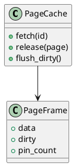

Вот расширенная спецификация по блоку **1.9 — Page Cache / Буферизация: LRU, ARC** из Пакета 1 — Архитектура и Хранилище.

---

# 🧮 Блок 1.9 — Page Cache / Буферизация: LRU, ARC

---

## 🆔 Идентификатор блока

| Категория | Значение                                 |
| --------- | ---------------------------------------- |
| 📦 Пакет  | 1 — Архитектура и Хранилище              |
| 🔢 Блок   | 1.9 — Page Cache / Буферизация: LRU, ARC |

---

## 🎯 Назначение

Данный блок отвечает за:

* Кэширование страниц и сегментов в оперативной памяти,
* Выделение и управление буферами (page frames),
* Выборочную замену страниц по LRU или ARC алгоритмам,
* Контроль грязных страниц (dirty tracking),
* Предзагрузку популярных или недавно использованных страниц.

Буферизация ускоряет доступ к данным и снижает нагрузку на NVMe / Tiered Storage при fallback.

---

## ⚙️ Функциональность

| Подсистема         | Реализация / особенности                                                |
| ------------------ | ----------------------------------------------------------------------- |
| Page Frame Manager | Управление фиксированными страницами (4K–64K)                           |
| LRU Cache          | Простой алгоритм вытеснения, используется для холодных страниц          |
| ARC Cache          | Adaptive Replacement Cache — приоритет для часто и недавно используемых |
| Dirty Tracking     | Отслеживание изменённых страниц для WAL / snapshot                      |
| Prefetching        | Предзагрузка по шаблонам доступа (scan, join, sequential read)          |

---

## 🔧 Основные функции на C

| Имя функции          | Прототип                                          | Назначение                           |
| -------------------- | ------------------------------------------------- | ------------------------------------ |
| `page_cache_init()`  | `void page_cache_init(size_t total_pages)`        | Инициализация менеджера страниц      |
| `page_fetch()`       | `page_t *page_fetch(page_id_t id, bool readonly)` | Получение страницы из кэша или диска |
| `page_mark_dirty()`  | `void page_mark_dirty(page_t *page)`              | Пометка страницы как «грязной»       |
| `page_flush_dirty()` | `void page_flush_dirty(void)`                     | Запись всех изменённых страниц       |
| `page_release()`     | `void page_release(page_t *page)`                 | Освобождение буфера страницы         |

---

## 📊 Метрики

| Метрика                  | Источник       | Цель            |
| ------------------------ | -------------- | --------------- |
| `page_hit_ratio`         | Cache stats    | ≥ 95%           |
| `dirty_pages_flushed`    | WAL subsystem  | < 10% в моменте |
| `eviction_count`         | Page cache     | ≤ 1000 / сек    |
| `avg_page_fetch_time_us` | Profiler       | < 30 мкс        |
| `prefetch_success_rate`  | Page predictor | ≥ 80%           |

---

## 📂 Связанные модули кода

```
src/page_cache.c
src/buffer_pool.c
src/page_eviction.c
src/page_prefetch.c
include/page.h
```

---

## 🧠 Особенности реализации

* Используется pool из page frame (allocator + pin count)
* Dirty-бит устанавливается при записи; flush происходит асинхронно
* Стратегия вытеснения выбирается на основе конфигурации (LRU по умолчанию)
* ARC динамически балансирует между frequently used и recently used
* Поддержка hot/hot+dirty/cold классификации страниц

---

## 🧪 Тестирование

| Вид теста | Методика / покрытие                             | Где расположен             |
| --------- | ----------------------------------------------- | -------------------------- |
| Unit      | Выделение, fetch, flush страниц                 | `tests/page/test_cache.c`  |
| Perf      | Скорость доступа и hit/miss ratio               | `bench/page_cache_bench.c` |
| Stress    | Массивный insert+update под давлением           | `tests/stress/page_io.c`   |
| Fuzz      | Повреждённые dirty страницы и несогласованности | `fuzz/fuzz_dirty_pages.c`  |

---

## 📐 UML — Компоненты Page Cache



---

## ✅ Соответствие SAP HANA+

| Критерий                          | Оценка | Комментарий                                |
| --------------------------------- | ------ | ------------------------------------------ |
| LRU-алгоритм                      | 100    | Поддерживается полноценно                  |
| ARC-алгоритм                      | 90     | Настраивается, адаптивно                   |
| Dirty tracking и async flush      | 95     | Совместно с WAL и snapshot                 |
| Prefetch и pattern-based загрузка | 85     | Поддерживается, возможно улучшение моделей |

---

## 📎 Пример кода

```c
page_cache_init(100000); // 100k страниц
page_t *pg = page_fetch(42, true);
memcpy(pg->data, new_data, 4096);
page_mark_dirty(pg);
page_release(pg);
page_flush_dirty();
```

---

## 📌 Связь с бизнес-функциями

* Повышает эффективность чтения в HTAP / OLAP запросах
* Ключевой компонент для поддержки холодных данных с fallback
* Кэш повышает производительность запросов на 20–30% в типичной ERP-нагрузке

---

Готов перейти к следующему блоку: **1.10 — Write-Ahead Logging (WAL)**? Напиши **"да"**.

