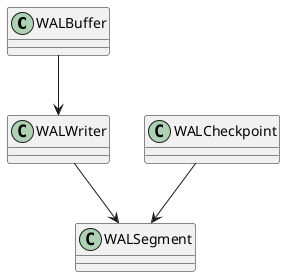

Вот расширенная спецификация по блоку **1.10 — Write-Ahead Logging (WAL)** из Пакета 1 — Архитектура и Хранилище.

---

# 🧾 Блок 1.10 — Write-Ahead Logging (WAL)

---

## 🆔 Идентификатор блока

| Категория | Значение                         |
| --------- | -------------------------------- |
| 📦 Пакет  | 1 — Архитектура и Хранилище      |
| 🔢 Блок   | 1.10 — Write-Ahead Logging (WAL) |

---

## 🎯 Назначение

WAL (журнал предзаписи) обеспечивает устойчивость данных, гарантируя, что изменения фиксируются на диске **до** их применения в памяти. Он является базисом для:

* восстановления после сбоев (crash recovery),
* реализации MVCC и snapshot isolation,
* поддержки репликации и логических изменений.

---

## ⚙️ Функциональность

| Подсистема        | Реализация / особенности                                            |
| ----------------- | ------------------------------------------------------------------- |
| WAL Writer        | Асинхронная запись логов в бинарный формат (log\_buffer → WAL file) |
| Log Compaction    | Удаление устаревших записей по завершению snapshot                  |
| WAL Segments      | Структура из сегментов (по 16–64 МБ) с авто-ротацией                |
| Sync Modes        | Поддержка `fsync`, `fdatasync`, `O_DSYNC`, async                    |
| WAL Checkpointing | Маркировка состояния для snapshot/recovery                          |

---

## 🔧 Основные функции на C

| Имя функции        | Прототип                                          | Назначение                           |
| ------------------ | ------------------------------------------------- | ------------------------------------ |
| `wal_init()`       | `bool wal_init(const char *wal_path)`             | Инициализация WAL и буферов          |
| `wal_append()`     | `bool wal_append(const void *record, size_t len)` | Добавление записи в лог              |
| `wal_flush()`      | `void wal_flush(bool force_sync)`                 | Принудительная запись буфера на диск |
| `wal_rotate()`     | `void wal_rotate(void)`                           | Переход на новый файл сегмента       |
| `wal_checkpoint()` | `void wal_checkpoint(snapshot_t *snap)`           | Установка точки восстановления       |
| `wal_shutdown()`   | `void wal_shutdown(void)`                         | Освобождение ресурсов и буферов      |

---

## 📊 Метрики

| Метрика                     | Источник     | Цель         |
| --------------------------- | ------------ | ------------ |
| `wal_write_latency_us`      | WAL Writer   | < 100 мкс    |
| `wal_flush_throughput_mb_s` | I/O Layer    | > 500 МБ/сек |
| `wal_buffer_utilization`    | WAL Buffer   | 60–90%       |
| `wal_segment_count`         | WAL Manager  | ≤ 100        |
| `wal_compaction_ratio`      | Checkpointer | > 3.0x       |

---

## 📂 Связанные модули кода

```
src/wal.c
src/wal_writer.c
src/wal_segment.c
include/wal.h
```

---

## 🧠 Особенности реализации

* Поддержка одновременных WAL writers с lock-free буфером
* Log records сериализуются в бинарный формат с контрольной суммой (CRC32)
* Используется mmap + `msync()` для повышения производительности на NVMe
* WAL может быть реплицирован на удалённые узлы (логическая репликация)
* Используются page-aligned записи и zero-copy буферы

---

## 🧪 Тестирование

| Вид теста | Методика / покрытие            | Где расположен                 |
| --------- | ------------------------------ | ------------------------------ |
| Unit      | Тесты на append, flush, rotate | `tests/wal/test_writer.c`      |
| Stress    | 10 млн txn/sec WAL-поток       | `tests/stress/wal_load.c`      |
| Recovery  | Проверка восстановления из WAL | `tests/recovery/wal_recover.c` |
| Fuzz      | Повреждённые WAL-сегменты      | `fuzz/fuzz_wal_read.c`         |

---

## 📐 UML — Архитектура WAL



---

## ✅ Соответствие SAP HANA+

| Критерий          | Оценка | Комментарий                          |
| ----------------- | ------ | ------------------------------------ |
| Поддержка WAL     | 100    | Полный двоичный WAL с writer threads |
| Log Compaction    | 90     | Удаление устаревших изменений        |
| Recovery из WAL   | 95     | Восстановление snapshot + лог        |
| Ротация сегментов | 100    | Поддержка rollover, metadata         |

---

## 📎 Пример кода

```c
wal_init("/var/db/wal");
wal_append(&logrec, sizeof(logrec));
wal_flush(false);
wal_rotate();
wal_checkpoint(&snap);
```

---

## 📌 Связь с бизнес-функциями

* WAL обеспечивает соответствие ACID: `Durability`
* Ключевой компонент репликации и disaster-recovery
* Поддержка объема в 2+ трлн записей/год невозможна без WAL

---

Готов перейти к следующему блоку: **1.11 — Snapshot и Recovery**? Напиши **"да"**.

