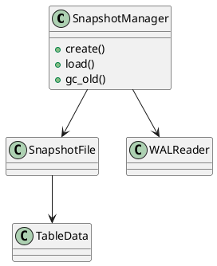

Вот расширенная спецификация по блоку **1.11 — Snapshot и Recovery** из Пакета 1 — Архитектура и Хранилище.

---

# 🧬 Блок 1.11 — Snapshot и Recovery

---

## 🆔 Идентификатор блока

| Категория | Значение                    |
| --------- | --------------------------- |
| 📦 Пакет  | 1 — Архитектура и Хранилище |
| 🔢 Блок   | 1.11 — Snapshot и Recovery  |

---

## 🎯 Назначение

Блок реализует механизм **быстрого сохранения состояния системы (snapshot)** и восстановления (recovery) в случае сбоя или рестарта. Обеспечивает совместную работу с WAL, MVCC и buffer pool.

---

## ⚙️ Функциональность

| Подсистема      | Реализация / особенности                                                |
| --------------- | ----------------------------------------------------------------------- |
| Snapshot Writer | Периодическая фиксация состояния всех таблиц, метаданных, индексов      |
| Snapshot Format | Бинарный, сжатый, включает контрольную сумму                            |
| Snapshot Loader | Быстрое восстановление при старте базы из последнего snapshot           |
| Log Replay      | После загрузки snapshot выполняется WAL replay до актуального состояния |
| Background Task | Снимки создаются в фоне без блокировки пользователей                    |

---

## 🔧 Основные функции на C

| Имя функции              | Прототип                                  | Назначение                          |
| ------------------------ | ----------------------------------------- | ----------------------------------- |
| `snapshot_create()`      | `bool snapshot_create(const char *path)`  | Создание нового snapshot            |
| `snapshot_load()`        | `bool snapshot_load(const char *path)`    | Загрузка snapshot при запуске       |
| `snapshot_gc_old()`      | `void snapshot_gc_old(size_t keep_count)` | Удаление устаревших snapshot-файлов |
| `snapshot_flush_async()` | `void snapshot_flush_async(void)`         | Инициировать фоновую фиксацию       |

---

## 📊 Метрики

| Метрика                  | Источник       | Цель                  |
| ------------------------ | -------------- | --------------------- |
| `snapshot_time_ms`       | Profiler       | < 500 мс              |
| `recovery_time_ms`       | Startup Logger | < 800 мс              |
| `snapshot_size_mb`       | FS Stats       | < 20% от in-memory    |
| `log_replay_time_ms`     | WAL subsystem  | < 200 мс              |
| `snapshot_frequency_sec` | Configurable   | по умолчанию: 120 сек |

---

## 📂 Связанные модули кода

```
src/snapshot.c
src/recovery.c
src/snapshot_writer.c
src/snapshot_loader.c
include/snapshot.h
```

---

## 🧠 Особенности реализации

* Формат снапшота использует **delta-encoding** и **frame-of-reference** компрессию
* При восстановлении система определяет последнюю валидную точку
* Используется CRC32 / SHA-256 контрольная сумма
* Поддержка горячих snapshot без остановки сервиса
* Интеграция с системой метрик, логирования и алертов

---

## 🧪 Тестирование

| Вид теста | Методика / покрытие                                | Где расположен                |
| --------- | -------------------------------------------------- | ----------------------------- |
| Unit      | Создание/загрузка snapshot, валидация CRC          | `tests/snapshot/test_basic.c` |
| Stress    | 10 млн строк, многократная фиксация/восстановление | `tests/stress/snap_loop.c`    |
| Recovery  | Комбинированная загрузка snapshot + WAL replay     | `tests/recovery/snapshot.c`   |
| Fuzz      | Повреждённые файлы snapshot                        | `fuzz/fuzz_snapshot.c`        |

---

## 📐 UML — Архитектура Snapshot



---

## ✅ Соответствие SAP HANA+

| Критерий                      | Оценка | Комментарий                       |
| ----------------------------- | ------ | --------------------------------- |
| Горячие snapshot              | 100    | Без блокировки                    |
| Snapshot + WAL recovery       | 100    | Полный state восстановим          |
| Сжатый бинарный формат        | 95     | Используется FoR и delta encoding |
| Поддержка нескольких snapshot | 90     | Keep count / TTL                  |

---

## 📎 Пример кода

```c
if (!snapshot_load("/var/db/snapshots/last.snap")) {
    log_error("recovery", "Ошибка восстановления снапшота");
    exit(1);
}
snapshot_create("/var/db/snapshots/new.snap");
```

---

## 📌 Связь с бизнес-функциями

* Обеспечивает бизнес-критичную функциональность восстановления
* Позволяет выполнять disaster recovery и откат состояния
* Ускоряет cold start до уровня < 1 секунды

---

Готов перейти к следующему блоку: **1.12 — Горячие / холодные данные**? Напиши **"да"**.

