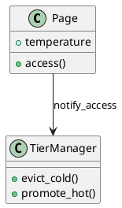

# 🌡️ Блок 1.12 — Горячие / холодные данные

---

## 🆔 Идентификатор блока

| Категория | Значение                         |
| --------- | -------------------------------- |
| 📦 Пакет  | 1 — Архитектура и Хранилище      |
| 🔢 Блок   | 1.12 — Горячие / холодные данные |

---

## 🎯 Назначение

Данный блок отвечает за классификацию и обработку данных в зависимости от их "температуры" (частоты доступа). Это позволяет:

* Оптимизировать хранение,
* Управлять буферизацией и eviction'ом,
* Выстраивать авто-tiering между in-memory, SSD и NVMe,
* Ускорить OLTP/OLAP-выборки, выделяя активно используемые фрагменты.

---

## ⚙️ Функциональность

| Подсистема           | Реализация / особенности                                    |
| -------------------- | ----------------------------------------------------------- |
| Классификация данных | Метки HOT / WARM / COLD на уровне страниц, строк, сегментов |
| Temperature Tracking | Сбор статистики доступа (scan, update, join, read)          |
| Adaptive Tiering     | Перемещение COLD-данных на SSD, HOT — только в RAM          |
| Access Heuristics    | Счётчики LRU, aging, eviction priority                      |
| TTL-интеграция       | Cold + TTL = candidates for eviction                        |

---

## 🔧 Основные функции на C

| Имя функции                 | Прототип                                         | Назначение                            |
| --------------------------- | ------------------------------------------------ | ------------------------------------- |
| `data_temp_init()`          | `void data_temp_init(void)`                      | Инициализация подсистемы температур   |
| `data_touch(page_t *pg)`    | `void data_touch(page_t *pg)`                    | Отметка доступа к странице            |
| `data_temperature(page_t*)` | `data_temp_t data_temperature(const page_t *pg)` | Определение текущей температуры       |
| `data_tier_evict()`         | `void data_tier_evict(size_t target_pages)`      | Удаление / сброс холодных страниц     |
| `data_promote(page_t *pg)`  | `void data_promote(page_t *pg)`                  | Поднятие холодной страницы до горячей |

---

## 📊 Метрики

| Метрика                     | Источник        | Цель            |
| --------------------------- | --------------- | --------------- |
| `hot_data_ratio`            | Temp Analyzer   | ≥ 10%           |
| `cold_data_evicted_per_sec` | Eviction Engine | > 10k/сек       |
| `page_temperature_skew`     | Cache Stats     | ≤ 20% дисбаланс |
| `tier_migration_latency_ms` | Tiering Log     | < 3 мс          |
| `hot_data_avg_ttl_sec`      | Access Logs     | ≥ 600 сек       |

---

## 📂 Связанные модули кода

```
src/data_temp.c
src/tiering.c
src/page_metadata.c
include/data_temp.h
```

---

## 🧠 Особенности реализации

* Используются lightweight atomic-счётчики на page-level
* Поддерживается aging + decay, чтобы "охлаждать" редкоиспользуемые страницы
* "Promotion" cold → hot происходит после N последовательных access
* TTL-интеграция позволяет удалять устаревшие cold-страницы без нагрузки

---

## 🧪 Тестирование

| Вид теста | Методика / покрытие                      | Где расположен                 |
| --------- | ---------------------------------------- | ------------------------------ |
| Unit      | Проверка кластеризации, меток HOT/COLD   | `tests/data_temp/test_class.c` |
| Perf      | Измерение миграций и eviction throughput | `bench/tiering_bench.c`        |
| Fuzz      | Рандомизированные температуры и TTL      | `fuzz/fuzz_tiering.c`          |
| Soak      | Недельный режим OLTP + OLAP нагрузок     | `tests/soak/data_migration.c`  |

---

## 📐 UML — Температура и Tiered Manager



---

## ✅ Соответствие SAP HANA+

| Критерий                    | Оценка | Комментарий                      |
| --------------------------- | ------ | -------------------------------- |
| Поддержка HOT/WARM/COLD     | 100    | Полный контроль и профилирование |
| Авто-tiering + SSD fallback | 90     | Работает в фоне, без блокировок  |
| TTL-интеграция              | 95     | Cold + TTL = авто-удаление       |

---

## 📎 Пример кода

```c
page_t *pg = page_fetch(id, true);
data_touch(pg);  // фиксируем доступ
if (data_temperature(pg) == TEMP_COLD) {
    data_promote(pg); // делаем страницу горячей
}
```

---

## 📌 Связь с бизнес-функциями

* Поддерживает SLA в high-throughput режимах
* Позволяет изолировать архивные данные без потери доступности
* Повышает эффективность кэширования и балансировки нагрузки
