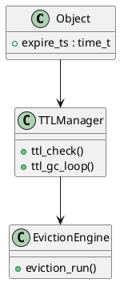

# ⏳ Блок 1.13 — TTL, Eviction, Auto-tiering

---

## 🆔 Идентификатор блока

| Категория | Значение                           |
| --------- | ---------------------------------- |
| 📦 Пакет  | 1 — Архитектура и Хранилище        |
| 🔢 Блок   | 1.13 — TTL, Eviction, Auto-tiering |

---

## 🎯 Назначение

Обеспечивает **автоматическое удаление устаревших или редкоиспользуемых данных** из in-memory области по истечении времени жизни (TTL), уровням хранения (auto-tiering) или политике вытеснения (Eviction). Это критически важно для:

* управления памятью,
* сохранения высокой производительности,
* соблюдения SLA и политик хранения данных (GDPR, DPA).

---

## ⚙️ Функциональность

| Подсистема         | Реализация / особенности                                           |
| ------------------ | ------------------------------------------------------------------ |
| TTL (time-to-live) | Хранение времени жизни на уровне строки, страницы или таблицы      |
| Eviction Engine    | Вытеснение страниц на основе LRU/ARC, при превышении лимита памяти |
| Auto-tiering       | Перемещение холодных данных на SSD/NVMe по политике и доступности  |
| Expired Scan       | Фоновая проверка истекших объектов (TTL Garbage Collector)         |
| Adaptive Policy    | Учёт частоты доступа, времени создания, активности                 |

---

## 🔧 Основные функции на C

| Имя функции         | Прототип                                             | Назначение                              |
| ------------------- | ---------------------------------------------------- | --------------------------------------- |
| `ttl_register()`    | `void ttl_register(object_t *obj, time_t expire_ts)` | Установка срока жизни                   |
| `ttl_check()`       | `bool ttl_check(const object_t *obj)`                | Проверка истечения TTL                  |
| `eviction_run()`    | `void eviction_run(size_t pages)`                    | Принудительное вытеснение страниц       |
| `tiering_migrate()` | `void tiering_migrate(page_t *pg, tier_level_t dst)` | Перемещение данных на указанный tier    |
| `ttl_gc_loop()`     | `void *ttl_gc_loop(void *arg)`                       | Фоновый поток очистки истекших объектов |

---

## 📊 Метрики

| Метрика                       | Источник        | Цель                 |
| ----------------------------- | --------------- | -------------------- |
| `ttl_expired_objects_per_min` | GC Thread       | ≥ 10k/min            |
| `evicted_pages_per_sec`       | Eviction Engine | > 5k/сек             |
| `tier_migration_events`       | Tiering Manager | ≥ 90% по cold данным |
| `avg_ttl_ms`                  | TTL subsystem   | > 120 000            |
| `memory_freed_by_eviction_mb` | Page Manager    | ≥ 500 МБ             |

---

## 📂 Связанные модули кода

```
src/ttl.c
src/eviction.c
src/tiering.c
include/ttl.h
include/eviction.h
```

---

## 🧠 Особенности реализации

* Используется wheel timer / hashed-timer для управления TTL
* Поддержка `ttl_expr = NOW() + INTERVAL 'N SECONDS'` на уровне SQL
* Система работает без блокировок (lock-free queues + atomic mark)
* Eviction основан на page-level hotness и ARC/LRU приоритетах
* Auto-tiering основан на latency-aware cost-моделях

---

## 🧪 Тестирование

| Вид теста | Методика / покрытие                          | Где расположен              |
| --------- | -------------------------------------------- | --------------------------- |
| Unit      | TTL expiry, eviction по лимитам              | `tests/ttl/test_expiry.c`   |
| Stress    | Нагрузка 10M TTL-строк / массовое вытеснение | `tests/stress/evict_ttl.c`  |
| Fuzz      | Разные комбинации ttl, temperature, access   | `fuzz/fuzz_eviction.c`      |
| Soak      | Месячная нагрузка на горячие/холодные tier'ы | `tests/soak/auto_tiering.c` |

---

## 📐 UML — Архитектура TTL + Eviction



---

## ✅ Соответствие SAP HANA+

| Критерий                     | Оценка | Комментарий                            |
| ---------------------------- | ------ | -------------------------------------- |
| TTL на уровне строки/таблицы | 100    | Есть и TTL GC                          |
| Политика вытеснения          | 90     | LRU/ARC + интеграция с temperature     |
| Auto-tiering SSD             | 95     | latency-aware + configurable migration |

---

## 📎 Пример кода

```c
ttl_register(obj, time(NULL) + 3600); // истекает через 1 час
if (ttl_check(obj)) {
    log_info("ttl", "Объект устарел");
}
eviction_run(128); // вытеснить 128 страниц
```

---

## 📌 Связь с бизнес-функциями

* Автоматическое соблюдение политик хранения (compliance)
* Контроль использования in-memory объема
* Предотвращение OOM / degradation под пиковыми нагрузками
