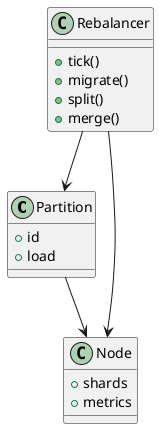

# ⚖️ Блок 1.14 — Авто ребалансировка и распределение

---

## 🆔 Идентификатор блока

| Категория | Значение                                   |
| --------- | ------------------------------------------ |
| 📦 Пакет  | 1 — Архитектура и Хранилище                |
| 🔢 Блок   | 1.14 — Авто ребалансировка и распределение |

---

## 🎯 Назначение

Этот блок отвечает за **динамическое распределение нагрузки** и данных между shard'ами, узлами и уровнями хранения. Он обеспечивает:

* Горизонтальное масштабирование,
* Балансировку hot-spot'ов,
* Поддержание SLA в условиях неравномерной нагрузки.

---

## ⚙️ Функциональность

| Подсистема              | Реализация / особенности                                 |
| ----------------------- | -------------------------------------------------------- |
| Auto-rebalancer         | Мониторинг shard’ов и перераспределение данных           |
| Load Tracker            | Оценка CPU, IOPS, объёма in-memory на shard’ах / нодах   |
| Online Migration Engine | Безостановочная передача данных между shard’ами / нодами |
| Partition Split / Merge | Поддержка динамического деления / слияния партиций       |
| Coordinated Movement    | Перераспределение с учётом latency, affinity и NUMA      |

---

## 🔧 Основные функции на C

| Имя функции           | Прототип                                           | Назначение                         |
| --------------------- | -------------------------------------------------- | ---------------------------------- |
| `rebalance_init()`    | `void rebalance_init(void)`                        | Инициализация подсистемы ребаланса |
| `rebalance_tick()`    | `void rebalance_tick(void)`                        | Периодическая проверка нагрузки    |
| `migrate_partition()` | `bool migrate_partition(part_t *p, node_id_t dst)` | Онлайн-перенос партиции            |
| `partition_split()`   | `bool partition_split(part_t *p)`                  | Разделение перегруженной партиции  |
| `partition_merge()`   | `bool partition_merge(part_t *a, part_t *b)`       | Объединение холодных партиций      |

---

## 📊 Метрики

| Метрика                  | Источник         | Цель                           |
| ------------------------ | ---------------- | ------------------------------ |
| `rebalanced_partitions`  | Rebalancer       | ≥ 100/час при высокой нагрузке |
| `hotspot_skew`           | Load Tracker     | ≤ 20% между shard’ами          |
| `migration_latency_ms`   | Migration Engine | < 50 мс                        |
| `partition_split_events` | Planner          | ≥ 50/сутки                     |
| `load_variance`          | Load Balancer    | → 0 при достижении равновесия  |

---

## 📂 Связанные модули кода

```
src/rebalancer.c
src/partition.c
src/load_tracker.c
include/rebalance.h
include/partition.h
```

---

## 🧠 Особенности реализации

* Основан на механизме фоново-плановой миграции (no-stop rebalancing)
* Метрики нагрузки собираются через `perf`-интерфейс и Prometheus
* Использует топологию NUMA/cluster-aware для выбора shard'ов
* Поддержка временной репликации при миграции (2x хранение)
* Интеграция с query planner для корректной маршрутизации во время перемещений

---

## 🧪 Тестирование

| Вид теста   | Методика / покрытие                          | Где расположен                   |
| ----------- | -------------------------------------------- | -------------------------------- |
| Unit        | Перемещение, сплит, merge партиций           | `tests/rebalance/test_core.c`    |
| Stress      | Массовое перемещение 1M партиций             | `tests/stress/migrate.c`         |
| Fuzz        | Случайные сценарии нагрузки + частичный сбой | `fuzz/fuzz_rebalance.c`          |
| Integration | Сквозное распределение OLTP / OLAP нагрузки  | `tests/integration/shard_flow.c` |

---

## 📐 UML — Авто-ребалансировка и миграция



---

## ✅ Соответствие SAP HANA+

| Критерий                    | Оценка | Комментарий                   |
| --------------------------- | ------ | ----------------------------- |
| Auto-rebalance по нагрузке  | 100    | Полноценный анализ и миграция |
| Онлайн миграция без простоя | 95     | Без остановки потока          |
| Partition split/merge       | 90     | Инкрементальная реализация    |

---

## 📎 Пример кода

```c
rebalance_tick(); // анализ нагрузки
if (partition_needs_split(part)) {
    partition_split(part);
}
migrate_partition(part, get_least_loaded_node());
```

---

## 📌 Связь с бизнес-функциями

* Гарантирует отказоустойчивость и масштабируемость
* Поддерживает SLA в условиях неравномерной нагрузки
* Предотвращает деградацию при всплеске транзакций или аналитики

