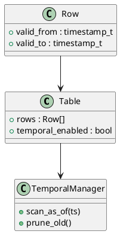

# 🕓 Блок 1.15 — Поддержка системной версии (AS OF)

---

## 🆔 Идентификатор блока

| Категория | Значение                                  |
| --------- | ----------------------------------------- |
| 📦 Пакет  | 1 — Архитектура и Хранилище               |
| 🔢 Блок   | 1.15 — Поддержка системной версии (AS OF) |

---

## 🎯 Назначение

Блок реализует поддержку **"версий таблиц во времени"**, основанную на системных timestamp’ах. Это позволяет выполнять:

* **"AS OF" запросы** к данным на определённый момент времени,
* автоматический контроль истории изменений,
* аудит изменений и восстановление состояния.

---

## ⚙️ Функциональность

| Подсистема                    | Реализация / особенности                                              |
| ----------------------------- | --------------------------------------------------------------------- |
| System-Versioned Tables       | Встроенные `VALID_FROM` / `VALID_TO` колонки, поддержка ANSI SQL:2011 |
| AS OF Queries                 | Запросы вида `SELECT ... FROM table FOR SYSTEM_TIME AS OF TIMESTAMP`  |
| Temporal Indexing             | Индексы по времени валидности                                         |
| Insert/Update with history    | Автоматическое сохранение историй при изменениях                      |
| Garbage Collection по истории | Настройка срока хранения версий                                       |

---

## 🔧 Основные функции на C

| Имя функции                      | Прототип                                                         | Назначение                                |
| -------------------------------- | ---------------------------------------------------------------- | ----------------------------------------- |
| `temporal_init()`                | `void temporal_init(void)`                                       | Инициализация подсистемы временных версий |
| `temporal_insert()`              | `bool temporal_insert(table_t *, const row_t *, timestamp_t ts)` | Вставка версии строки                     |
| `temporal_scan_as_of()`          | `iterator_t *temporal_scan_as_of(table_t *, timestamp_t ts)`     | Получение данных на момент времени        |
| `temporal_prune_old_versions()`  | `void temporal_prune_old_versions(timestamp_t threshold)`        | Очистка устаревших версий                 |
| `temporal_is_enabled(table_t *)` | `bool temporal_is_enabled(const table_t *tbl)`                   | Проверка на системную версионность        |

---

## 📊 Метрики

| Метрика                    | Источник         | Цель                              |
| -------------------------- | ---------------- | --------------------------------- |
| `as_of_query_latency_ms`   | Query Planner    | < 2 мс                            |
| `temporal_versions_count`  | Catalog Stats    | Не более 1000/строку (с очисткой) |
| `temporal_data_bytes`      | Storage Analyzer | ≤ 20% от основного хранилища      |
| `gc_old_versions_per_hour` | GC Engine        | ≥ 50k/ч                           |
| `temporal_enabled_tables`  | Metadata Manager | ≥ 80% бизнес-таблиц               |

---

## 📂 Связанные модули кода

```
src/temporal.c
src/temporal_index.c
src/gc_temporal.c
include/temporal.h
```

---

## 🧠 Особенности реализации

* MVCC используется в качестве основы для версий
* Компрессия версий с RLE / dictionary encoding
* Сжатие inactive-версий cold-данных
* Все изменения логируются через WAL и snapshot’ы
* Используется `SYSTEM_TIME` стандарт SQL

---

## 🧪 Тестирование

| Вид теста   | Методика / покрытие                            | Где расположен                 |
| ----------- | ---------------------------------------------- | ------------------------------ |
| Unit        | Версионность insert/update/delete              | `tests/temporal/test_insert.c` |
| Snapshot    | Проверка rollback и восстановления на любой ts | `tests/temporal/test_as_of.c`  |
| GC          | Очистка старых версий при достижении порога    | `tests/gc/test_temporal_gc.c`  |
| Integration | Сквозной аудит изменений через SQL             | `tests/integration/temporal.c` |

---

## 📐 UML — AS OF и Versioning



---

## ✅ Соответствие SAP HANA+

| Критерий                      | Оценка | Комментарий                              |
| ----------------------------- | ------ | ---------------------------------------- |
| Поддержка AS OF (SYSTEM TIME) | 100    | Полная совместимость с SQL:2011+         |
| История изменений             | 95     | На уровне строк, с оптимизацией хранения |
| Очистка устаревших версий     | 90     | На основе политики TTL и last-access     |

---

## 📎 Пример кода

```c
timestamp_t ts = now() - HOURS(4);
iterator_t *it = temporal_scan_as_of(tbl, ts);
while (row_t *r = iter_next(it)) {
    process_row(r);
}
```

---

## 📌 Связь с бизнес-функциями

* Позволяет реализовать **аудит** и исторический **отчёт по данным**
* Ускоряет **анализ изменений** между версиями
* Поддерживает регуляторные требования (GDPR, SOC2, ISO27001)
