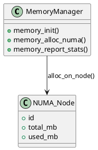

# 🧠 Блок 1.16 — Поддержка большого объема памяти

---

## 🆔 Идентификатор блока

| Категория | Значение                                |
| --------- | --------------------------------------- |
| 📦 Пакет  | 1 — Архитектура и Хранилище             |
| 🔢 Блок   | 1.16 — Поддержка большого объема памяти |

---

## 🎯 Назначение

Обеспечивает эффективную работу In-Memory СУБД на системах с **массивным объёмом оперативной памяти** (1+ ТБ, до 5+ ПБ), включая NUMA-архитектуры, RDIMM/3DS DIMM, и PMEM (Persistent Memory).

Позволяет:

* Использовать всё доступное ОЗУ,
* Минимизировать latencies при доступе,
* Эффективно размещать данные и фоновые структуры по NUMA-нодам,
* Поддерживать тонкую настройку лимитов на память и мониторинг.

---

## ⚙️ Функциональность

| Подсистема                  | Реализация / особенности                                             |
| --------------------------- | -------------------------------------------------------------------- |
| NUMA-aware allocation       | Размещение страниц и буферов по нодам в зависимости от топологии     |
| Huge Pages / 1G Pages       | Поддержка Transparent / Explicit Huge Pages (настраивается в config) |
| Memory manager              | Аренный аллокатор с контролем регионов и фрагментации                |
| Per-node memory quota       | Лимитирование потребления памяти на NUMA-ноду                        |
| Memory statistics           | Глубокая аналитика по регионам, аллокаторам, страницам               |
| Load balancing (allocation) | Учет свободной памяти, пропускной способности канала (DDR5/PMEM)     |

---

## 🔧 Основные функции на C

| Имя функции                 | Прототип                                                   | Назначение                     |
| --------------------------- | ---------------------------------------------------------- | ------------------------------ |
| `memory_init()`             | `void memory_init(void)`                                   | Инициализация менеджера памяти |
| `memory_alloc_numa()`       | `void *memory_alloc_numa(size_t size, int node_id)`        | Выделение памяти на NUMA-ноду  |
| `memory_get_available_mb()` | `uint64_t memory_get_available_mb(void)`                   | Общий доступный объём памяти   |
| `memory_report_stats()`     | `void memory_report_stats(FILE *out)`                      | Вывод статистики               |
| `memory_enforce_limits()`   | `bool memory_enforce_limits(session_t *sess, size_t size)` | Проверка лимитов при аллокации |

---

## 📊 Метрики

| Метрика                        | Источник        | Цель                      |
| ------------------------------ | --------------- | ------------------------- |
| `mem_total_mb`                 | Memory Manager  | > 1 000 000 (1 ТБ)        |
| `mem_used_per_node_mb`         | NUMA Tracker    | равномерное распределение |
| `mem_fragmentation_ratio`      | Allocator Stats | < 1.5                     |
| `hugepage_utilization_percent` | Kernel / perf   | > 90%                     |
| `allocation_latency_ns`        | Memtrace        | < 500 нс                  |

---

## 📂 Связанные модули кода

```
src/memory.c
src/memory_numa.c
src/memory_debug.c
include/memory.h
```

---

## 🧠 Особенности реализации

* Поддержка **libnuma**, `mbind()`, `numa_alloc_onnode()` (или собственные mmap-контроллеры)
* Настройка страниц: `MADV_HUGEPAGE`, `MAP_HUGETLB`, `MAP_POPULATE`
* Контроль OOM через аллокатор, не допуская аварийных остановок
* Поддержка Memory Pressure Trigger — backpressure в WAL / ingest

---

## 🧪 Тестирование

| Вид теста   | Методика / покрытие                                      | Где расположен                   |
| ----------- | -------------------------------------------------------- | -------------------------------- |
| Unit        | Проверка аллокаций, освобождения, HugePages              | `tests/memory/test_alloc.c`      |
| NUMA        | Выделение/заполнение с учётом ноды, проверка латентности | `tests/memory/test_numa.c`       |
| Stress      | Выделение и удаление 1 млрд объектов по разным нодам     | `tests/stress/hugepages_alloc.c` |
| Performance | Бенчмарк latency alloc vs NUMA node distance             | `bench/memory/bench_latency.c`   |

---

## 📐 UML — Управление памятью



---

## ✅ Соответствие SAP HANA+

| Критерий                             | Оценка | Комментарий                     |
| ------------------------------------ | ------ | ------------------------------- |
| NUMA-aware размещение                | 100    | Поддержка mbind, distance-aware |
| HugePages                            | 90     | Поддержка 2М и 1Г страниц       |
| Тонкий контроль лимитов и статистика | 95     | session-level + per-node        |

---

## 📎 Пример кода

```c
memory_init();
void *ptr = memory_alloc_numa(4 * 1024 * 1024, 1); // 4MB на NUMA-ноду 1
memory_report_stats(stdout);
```

---

## 📌 Связь с бизнес-функциями

* Позволяет эффективно использовать всю доступную оперативную память серверов
* Устраняет деградации производительности при больших объёмах in-memory
* Обеспечивает предсказуемую латентность под высокими нагрузками
