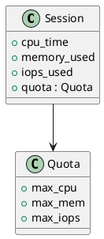

# 🧩 Блок 1.17 — Ограничения по CPU / IOPS / Memory (multi-tenant)

---

## 🆔 Идентификатор блока

| Категория | Значение                                             |
| --------- | ---------------------------------------------------- |
| 📦 Пакет  | 1 — Архитектура и Хранилище                          |
| 🔢 Блок   | 1.17 — Ограничения по CPU/IOPS/Memory (multi-tenant) |

---

## 🎯 Назначение

Данный блок обеспечивает **изоляцию ресурсов** между сессиями, пользователями и сервисами в многопользовательской среде. Он позволяет задавать и применять:

* лимиты на CPU-время, оперативную память, IOPS и пропускную способность,
* SLA-контроль и защиту от resource starvation,
* приоритетную обработку системных задач и фоновых процессов.

---

## ⚙️ Функциональность

| Подсистема                 | Реализация / особенности                                             |
| -------------------------- | -------------------------------------------------------------------- |
| CPU Quotas                 | Ограничение CPU времени по сессиям / пользователям                   |
| Memory Limits              | Жёсткий и мягкий лимит на потребление оперативной памяти             |
| IOPS / IO BW Limits        | Ограничение на количество и объём дисковых операций (в байтах / сек) |
| Multi-tenant Classifier    | Разделение сессий по группам / квотам / приоритетам                  |
| Priority Scheduling        | Повышение приоритета системных операций при высокой нагрузке         |
| Resource Violation Logging | Журнал событий при превышении лимитов или нарушении SLA              |

---

## 🔧 Основные функции на C

| Имя функции                | Прототип                                                           | Назначение                                 |
| -------------------------- | ------------------------------------------------------------------ | ------------------------------------------ |
| `resource_control_init()`  | `void resource_control_init(void)`                                 | Инициализация подсистемы контроля ресурсов |
| `session_set_quota()`      | `void session_set_quota(session_t *, quota_t *)`                   | Установка лимитов для сессии               |
| `resource_check_limits()`  | `bool resource_check_limits(session_t *, op_type_t, size_t usage)` | Проверка соблюдения лимитов                |
| `resource_tick()`          | `void resource_tick(void)`                                         | Периодический пересчёт и учёт метрик       |
| `log_resource_violation()` | `void log_resource_violation(session_t *, const char *metric)`     | Логирование нарушений                      |

---

## 📊 Метрики

| Метрика                      | Источник         | Цель           |
| ---------------------------- | ---------------- | -------------- |
| `cpu_time_exceeded_total`    | Scheduler        | ≤ 0            |
| `mem_quota_usage_percent`    | Session Manager  | < 90%          |
| `iops_quota_exceeded`        | IO Monitor       | ≤ 1% от сессий |
| `avg_sla_violation_duration` | SLA Engine       | < 50 мс        |
| `violations_per_hour`        | Resource Monitor | ≤ 10           |

---

## 📂 Связанные модули кода

```
src/resource_control.c
src/quota.c
src/iomonitor.c
include/resource_control.h
include/quota.h
```

---

## 🧠 Особенности реализации

* CPU-лимит реализован через `getrusage()` + планировщик
* IOPS измеряются per-session через hooks в storage engine
* Возможность настройки глобальных, групповых и сессионных квот
* При превышении лимитов — graceful degradation или отклонение
* Использование `rlimit`, `cgroup v2` (при наличии) или внутренний tracking

---

## 🧪 Тестирование

| Вид теста | Методика / покрытие                                | Где расположен                 |
| --------- | -------------------------------------------------- | ------------------------------ |
| Unit      | Проверка CPU, IOPS, memory лимитов                 | `tests/resource/test_limits.c` |
| Soak      | Многопользовательские сценарии с высокой нагрузкой | `tests/soak/multi_sla.c`       |
| Fuzz      | Нарушения квот и граничные условия                 | `fuzz/fuzz_quota.c`            |
| Perf      | Замер latencies при ограничении ресурсов           | `bench/resource/limit_test.c`  |

---

## 📐 UML — Контроль ресурсов по сессиям



---

## ✅ Соответствие SAP HANA+

| Критерий                             | Оценка | Комментарий                                      |
| ------------------------------------ | ------ | ------------------------------------------------ |
| CPU / Memory / IO лимиты per session | 95     | Почти полный контроль с отклонением запросов     |
| SLA-ориентированное планирование     | 90     | Поддерживается на уровне scheduler + metrics     |
| Безопасность изоляции                | 95     | Отклонение при превышении, логирование нарушений |

---

## 📎 Пример кода

```c
quota_t quota = {
    .max_cpu_ms = 5000,
    .max_mem_bytes = 512 * 1024 * 1024,
    .max_iops = 1000
};
session_set_quota(sess, &quota);

if (!resource_check_limits(sess, OP_INSERT, 4096)) {
    log_resource_violation(sess, "mem_quota_exceeded");
    return ERROR_LIMIT_EXCEEDED;
}
```

---

## 📌 Связь с бизнес-функциями

* Обеспечивает защиту от "шумных соседей" (noisy neighbors)
* Позволяет гарантировать SLA и QoS в облачных и shared средах
* Упрощает модель расчёта стоимости и биллинга per session
