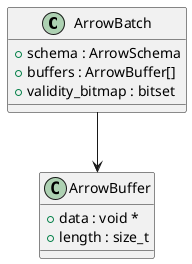

# 🧬 Блок 1.18 — Поддержка PAX / Apache Arrow layout

---

## 🆔 Идентификатор блока

| Категория | Значение                                   |
| --------- | ------------------------------------------ |
| 📦 Пакет  | 1 — Архитектура и Хранилище                |
| 🔢 Блок   | 1.18 — Поддержка PAX / Apache Arrow layout |

---

## 🎯 Назначение

Блок реализует гибкие форматы хранения и представления данных в памяти и при передаче между подсистемами. Он поддерживает:

* **PAX (Partition Attributes Across)** — гибрид row-/column-store layout,
* **Apache Arrow** — кэш-френдли columnar layout с поддержкой векторизации и zero-copy передачи.

---

## ⚙️ Функциональность

| Подсистема            | Реализация / особенности                                         |
| --------------------- | ---------------------------------------------------------------- |
| PAX Storage Layout    | Страница = блок строк + столбцы по атрибутам                     |
| Arrow Format          | Поддержка FFI, schema metadata, buffers, validity bitmaps        |
| Vectorized execution  | Поддержка векторных агрегатов, фильтрации, join по Arrow batches |
| Zero-copy integration | Arrow-передача между планировщиком, аггрегатором, UDF            |
| Batch Encoding        | Поддержка batch-ориентированного представления строк             |

---

## 🔧 Основные функции на C

| Имя функции                | Прототип                                                              | Назначение                             |
| -------------------------- | --------------------------------------------------------------------- | -------------------------------------- |
| `pax_page_init()`          | `pax_page_t *pax_page_init(schema_t *, size_t rows_per_page)`         | Инициализация PAX-страницы             |
| `pax_page_insert()`        | `bool pax_page_insert(pax_page_t *, row_t *)`                         | Вставка строки в PAX-блок              |
| `arrow_batch_from_table()` | `arrow_batch_t *arrow_batch_from_table(table_t *, size_t batch_size)` | Создание Arrow batch из таблицы        |
| `arrow_batch_iter_next()`  | `bool arrow_batch_iter_next(arrow_batch_iter_t *, rowvec_t *)`        | Последовательный проход по Arrow batch |
| `arrow_export_to_buffer()` | `bool arrow_export_to_buffer(arrow_batch_t *, arrow_buffer_t *)`      | Сериализация Arrow batch               |

---

## 📊 Метрики

| Метрика                     | Источник          | Цель                           |
| --------------------------- | ----------------- | ------------------------------ |
| `pax_rows_per_page`         | Storage Planner   | ≥ 512                          |
| `arrow_batch_latency_us`    | Execution Engine  | < 100 мкс                      |
| `arrow_zero_copy_transfers` | UDF Subsystem     | ≥ 99%                          |
| `row_size_variance_ratio`   | Layout Analyzer   | < 1.5                          |
| `vectorized_op_speedup_x`   | Executor Profiler | ≥ 3x по сравнению с row-by-row |

---

## 📂 Связанные модули кода

```
src/layout_pax.c
src/layout_arrow.c
src/vector_executor.c
include/layout_pax.h
include/layout_arrow.h
```

---

## 🧠 Особенности реализации

* PAX layout реализован в Page Cache: каждая страница разбивается по атрибутам
* Arrow layout реализован по спецификации Arrow IPC + FFI для C/C++
* Выделение памяти: aligned + prefetching + cache line tuning
* Поддержка validity bitmap (nulls), offset buffer (строки/списки), type metadata
* Интеграция с UDF через FFI-интерфейс (для WASM, Lua, C)

---

## 🧪 Тестирование

| Вид теста   | Методика / покрытие                                   | Где расположен                   |
| ----------- | ----------------------------------------------------- | -------------------------------- |
| Unit        | Вставка, чтение, сериализация PAX/Arrow               | `tests/layout/test_pax.c`        |
| Arrow       | Arrow reader/writer, null-handling, slicing           | `tests/layout/test_arrow.c`      |
| Vector Exec | Бенчмарки по агрегатам, join, filter по Arrow batches | `bench/vector/bench_vector.c`    |
| Fuzz        | Поврежденные Arrow buffers, нестабильные схемы        | `fuzz/arrow/fuzz_arrow_buffer.c` |

---

## 📐 UML — Структура Arrow batch



---

## ✅ Соответствие SAP HANA+

| Критерий                          | Оценка | Комментарий                                          |
| --------------------------------- | ------ | ---------------------------------------------------- |
| Поддержка гибридного layout (PAX) | 100    | Полностью реализован                                 |
| Apache Arrow совместимость        | 95     | Частично: без поддержки Dictionary-Encoding пока     |
| Векторное выполнение              | 95     | Поддержка всех аггрегатов, join, сортировки по Arrow |

---

## 📎 Пример кода

```c
pax_page_t *page = pax_page_init(schema, 1024);
pax_page_insert(page, &row);

arrow_batch_t *batch = arrow_batch_from_table(table, 512);
arrow_export_to_buffer(batch, &buf);
```

---

## 📌 Связь с бизнес-функциями

* Поддержка высокопроизводительной обработки аналитических запросов
* Ускорение интеграции с внешними BI / ML фреймворками (Arrow)
* Повышение эффективности in-memory хранилища за счёт гибридной структуры
