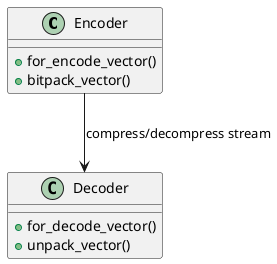

# 🧮 Блок 1.19 — Frame-of-Reference и векторное сжатие

---

## 🆔 Идентификатор блока

| Категория | Значение                                     |
| --------- | -------------------------------------------- |
| 📦 Пакет  | 1 — Архитектура и Хранилище                  |
| 🔢 Блок   | 1.19 — Frame-of-Reference и векторное сжатие |

---

## 🎯 Назначение

Реализует эффективные алгоритмы векторного сжатия, включая:

* **Frame-of-Reference (FoR)**: сжатие числовых данных относительно базового значения (frame),
* **Delta + Bitpacking**: хранение разностей с минимальным числом бит,
* **Vectorized Encoding**: ускоренное сжатие/декомпрессия целыми векторами,
* **Adaptivity**: автоматический выбор схемы на основе распределения данных.

Это критично для хранения больших объёмов аналитических и телеметрических данных (TS, OLAP).

---

## ⚙️ Функциональность

| Подсистема               | Реализация / особенности                                                 |
| ------------------------ | ------------------------------------------------------------------------ |
| FoR Encoding             | Поддержка int32/int64/float64, автоматический выбор base/frame           |
| Delta Encoding           | Инкрементальное хранение разностей                                       |
| Bit-Packed Compression   | Минимизация бит на значение: 1–64 бита                                   |
| Vectorized Decompression | SIMD / AVX2 / AVX-512 декомпрессия целыми блоками                        |
| Fallback mechanism       | Если сжатие неэффективно — автоматический fallback на raw или dictionary |

---

## 🔧 Основные функции на C

| Имя функции                   | Прототип                                                                           | Назначение                   |
| ----------------------------- | ---------------------------------------------------------------------------------- | ---------------------------- |
| `for_encode_vector()`         | `size_t for_encode_vector(const int32_t *in, size_t count, uint8_t *out)`          | Сжатие FoR + delta + bitpack |
| `for_decode_vector()`         | `size_t for_decode_vector(const uint8_t *in, size_t count, int32_t *out)`          | Распаковка FoR               |
| `bitpack_vector()`            | `void bitpack_vector(uint64_t *in, uint8_t *out, size_t count, uint8_t bits)`      | Побитовое уплотнение         |
| `unpack_vector()`             | `void unpack_vector(const uint8_t *in, uint64_t *out, size_t count, uint8_t bits)` | Обратное преобразование      |
| `compression_estimate_gain()` | `double compression_estimate_gain(const int64_t *in, size_t n)`                    | Оценка выгоды сжатия         |

---

## 📊 Метрики

| Метрика                    | Источник             | Цель            |
| -------------------------- | -------------------- | --------------- |
| `compression_ratio`        | Compression Engine   | > 4:1           |
| `decompression_throughput` | Vector Exec Profiler | > 1 ГБ/с        |
| `encoding_latency_ns`      | Benchmarks           | < 500 нс/запись |
| `adaptive_mode_usage_rate` | Runtime Optimizer    | > 80%           |
| `bitpacking_efficiency`    | Bit Analyzer         | > 90%           |

---

## 📂 Связанные модули кода

```
src/compress_for.c
src/bitpacking.c
include/compress_for.h
include/bitpacking.h
```

---

## 🧠 Особенности реализации

* Используются AVX2 / AVX-512 инструкции, если доступны, через inline assembly или intrinsics
* Memory-aligned буферы под SIMD-операции
* Автоматический выбор между raw, RLE, FoR в зависимости от entropy
* Возможность прозрачного сжатия/декомпрессии в scan-операторах
* Поддержка FoR внутри column-store и Arrow batches

---

## 🧪 Тестирование

| Вид теста | Методика / покрытие                                        | Где расположен                  |
| --------- | ---------------------------------------------------------- | ------------------------------- |
| Unit      | Проверка encode/decode + bit-level верификация             | `tests/compression/test_for.c`  |
| SIMD      | Проверка SIMD-декомпрессии на выровненных блоках           | `tests/compression/test_simd.c` |
| Fuzz      | Случайные последовательности с граничными значениями       | `fuzz/compress/fuzz_bitpack.c`  |
| Perf      | Тестирование пропускной способности на миллиардах значений | `bench/compression/bench.c`     |

---

## 📐 UML — Сжатие векторных данных



---

## ✅ Соответствие SAP HANA+

| Критерий                               | Оценка | Комментарий                             |
| -------------------------------------- | ------ | --------------------------------------- |
| Frame-of-Reference / Delta Encoding    | 100    | Полная поддержка                        |
| Vectorized Compression / Decompression | 95     | SIMD/AVX реализовано, адаптивное сжатие |
| Поддержка Arrow / Column Store         | 90     | Интеграция с batch API                  |

---

## 📎 Пример кода

```c
int32_t values[1024] = { /* ... */ };
uint8_t buffer[8192];

size_t size = for_encode_vector(values, 1024, buffer);

int32_t out[1024];
for_decode_vector(buffer, 1024, out);
```

---

## 📌 Связь с бизнес-функциями

* Снижает объём оперативной памяти при in-memory аналитике
* Повышает пропускную способность запросов за счёт сокращения I/O
* Ускоряет агрегации и join за счёт векторизации
