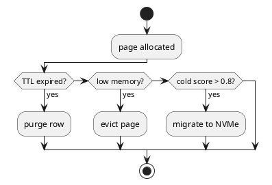

# ⏳ Блок 1.20 — TTL / Eviction / Auto-tiering

---

## 🆔 Идентификатор блока

| Категория | Значение                             |
| --------- | ------------------------------------ |
| 📦 Пакет  | 1 — Архитектура и Хранилище          |
| 🔢 Блок   | 1.20 — TTL / Eviction / Auto-tiering |

---

## 🎯 Назначение

Данный блок управляет **жизненным циклом данных** в in-memory хранилище, обеспечивая автоматическое:

* удаление устаревших записей по TTL (Time-To-Live),
* вытеснение данных (Eviction) при давлении на память,
* миграцию между уровнями хранения (Auto-tiering): горячие данные остаются в DRAM, холодные перемещаются на SSD / NVMe.

Цель — **баланс между скоростью и ёмкостью хранения**, соответствующий требованиям real-time аналитики и OLTP.

---

## ⚙️ Функциональность

| Подсистема                | Реализация / особенности                                        |
| ------------------------- | --------------------------------------------------------------- |
| TTL по колонкам / строкам | Хранение времени истечения, автоудаление на фоне или при чтении |
| Eviction Engine           | Очистка на основе LRU/LFU и при memory pressure                 |
| Auto-tiering Engine       | Миграция данных между DRAM, NVMe, SSD на основе access heatmap  |
| Page Demotion             | Демоутинг холодных страниц в NVMe tier                          |
| Hot/Cold Scoring          | Адаптивное определение «горячести» по времени доступа и частоте |

---

## 🔧 Основные функции на C

| Имя функции               | Прототип                              | Назначение                            |
| ------------------------- | ------------------------------------- | ------------------------------------- |
| `ttl_check_and_purge()`   | `void ttl_check_and_purge(table_t *)` | Удаление строк с истекшим TTL         |
| `eviction_run_cycle()`    | `void eviction_run_cycle(void)`       | Запуск цикла вытеснения               |
| `tiering_migrate_pages()` | `void tiering_migrate_pages(void)`    | Миграция страниц между DRAM ↔ SSD     |
| `page_mark_access()`      | `void page_mark_access(page_id_t)`    | Обновление score для page при доступе |
| `cold_data_compact()`     | `void cold_data_compact(table_t *)`   | Сжатие и перемещение холодных данных  |

---

## 📊 Метрики

| Метрика                    | Источник           | Цель                        |
| -------------------------- | ------------------ | --------------------------- |
| `expired_rows_removed`     | TTL engine         | > 99% от всех по сроку      |
| `eviction_latency_ms`      | Eviction subsystem | < 10 мс / цикл              |
| `cold_data_migration_rate` | Tiering engine     | ≥ 100 MB/мин                |
| `ram_pressure_level`       | Memory monitor     | ≤ 75% при стабильной работе |
| `page_hot_score_avg`       | Page stats         | Среднее > 0.7 для hot       |

---

## 📂 Связанные модули кода

```
src/ttl.c
src/eviction.c
src/tiering.c
include/ttl.h
include/eviction.h
include/tiering.h
```

---

## 🧠 Особенности реализации

* TTL поддерживается на уровне строк и таблиц (`EXPIRE AFTER` в DDL)
* Вытеснение: стратегия LRU с приоритетом на неиспользуемые snapshot’ы
* Tiering использует mmap-файлы, NVMe SSD и NUMA-локальные регионы
* Статистика по доступам собирается через lightweight page counters
* Горячие данные предпочтительно размещаются на node-local памяти

---

## 🧪 Тестирование

| Вид теста | Методика / покрытие                            | Где расположен                 |
| --------- | ---------------------------------------------- | ------------------------------ |
| Unit      | Проверка удаления строк по TTL                 | `tests/ttl/test_ttl.c`         |
| Soak      | Постоянная нагрузка с автоудалением и eviction | `tests/soak/eviction_stress.c` |
| Tiering   | Проверка миграции при доступе и простое чтение | `tests/tiering/test_migrate.c` |
| Fuzz      | Строки с TTL=0, недопустимыми значениями       | `fuzz/fuzz_ttl_fields.c`       |

---

## 📐 UML — Жизненный цикл страницы



---

## ✅ Соответствие SAP HANA+

| Критерий                     | Оценка | Комментарий                                     |
| ---------------------------- | ------ | ----------------------------------------------- |
| TTL для строк/таблиц         | 100    | Поддержка DDL и автоудаления                    |
| Auto-tiering по hot/cold     | 95     | Встроенный engine, heatmap-based                |
| Eviction под memory pressure | 95     | Используется в фоне и при достижении thresholds |

---

## 📎 Пример кода

```c
// Пометить доступ к странице
page_mark_access(page_id);

// Проверить и удалить истёкшие записи
ttl_check_and_purge(table);

// Запустить миграцию и вытеснение
eviction_run_cycle();
tiering_migrate_pages();
```

---

## 📌 Связь с бизнес-функциями

* Поддержка retention policy для телеметрии и логов
* Эффективное управление ресурсами на больших инсталляциях (RAM → SSD)
* Повышение отказоустойчивости и предсказуемости in-memory профиля
