Хорошо, начинаем с **📦 Пакета 0 — Инициализация и системный старт**.

---

## 🧩 Этап 1: Список блоков пакета 0 (напоминание)

| ID   | Название блока                           |
| ---- | ---------------------------------------- |
| 0.1  | Точка входа: main()                      |
| 0.2  | Загрузка конфигурационных параметров     |
| 0.3  | Обработка аргументов командной строки    |
| 0.4  | Инициализация системных сигналов         |
| 0.5  | Инициализация подсистем ядра             |
| 0.6  | Загрузка схем и таблиц при старте        |
| 0.7  | Инициализация логирования                |
| 0.8  | Запуск фоновых и служебных потоков       |
| 0.9  | Установка режима работы                  |
| 0.10 | Инициализация системы профилирования     |
| 0.11 | Инициализация планировщика задач         |
| 0.12 | Загрузка компонентов и расширений        |
| 0.13 | Режим тестирования / отладочный режим    |
| 0.14 | Контроль жизненного цикла процессов      |
| 0.15 | Завершение работы                        |
| 0.16 | Контроль версий при запуске              |
| 0.17 | Обработка исключений                     |
| 0.18 | Блокировка двойного запуска экземпляра   |
| 0.19 | Установка начального состояния подсистем |

---

## 🔗 Этап 2: Связи между блоками (ручная семантическая модель)

### 🔹 Исходящие связи

| Блок     | Исходящие связи к блокам                  | Комментарий                                           |
| -------- | ----------------------------------------- | ----------------------------------------------------- |
| 0.1 main | 0.2 → 0.7 → 0.5 → 0.8 → 0.9 → 0.11 → 0.14 | Координация запуска                                   |
| 0.2      | 0.5, 0.7, 0.9                             | Конфигурация передаётся в подсистемы                  |
| 0.5      | 0.6, 0.10, 0.11                           | Подсистемы инициализируются после ядра                |
| 0.7      | —                                         | Инициализирует логирование                            |
| 0.9      | 0.11, 0.14                                | От режима зависит планировщик и контроль              |
| 0.11     | 0.8                                       | Планировщик запускает фоновые задачи                  |
| 0.6      | —                                         | Загрузка схем — изолированно                          |
| 0.15     | —                                         | Завершение — терминальный блок                        |
| 0.13     | 0.2, 0.5                                  | Тестовый режим влияет на конфигурацию и инициализацию |
| 0.17     | 0.15                                      | Ошибки → завершение                                   |
| 0.18     | 0.1                                       | Блокирует вход при повторном запуске                  |

---

## 📈 Этап 3: PlantUML — Пакет 0

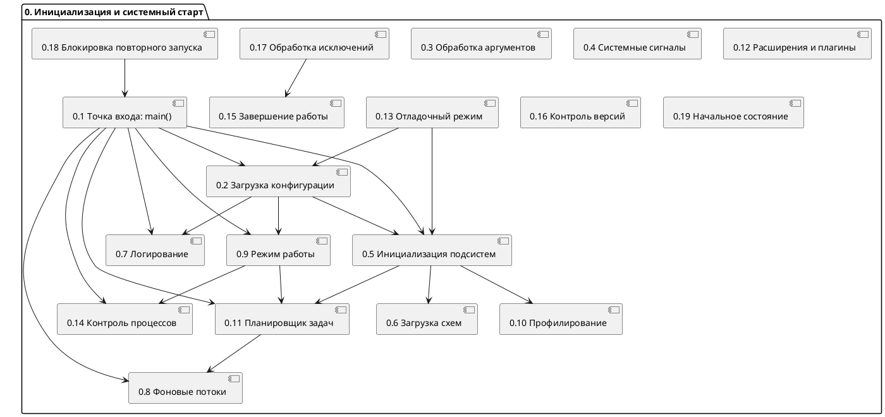

---

### 📄 Хочешь:

* Вывести SVG или PNG?
* Таблицу входящих связей?
* Начать следующий пакет (Пакет 1)?

Жду команды.

Отлично, переходим к **📦 Пакету 1 — Архитектура и хранилище**.

---

## 🧩 Этап 1: Список блоков пакета 1 (напоминание)

| ID   | Название блока                           |
| ---- | ---------------------------------------- |
| 1.1  | Row-ориентированное хранилище            |
| 1.2  | Column-ориентированное хранилище         |
| 1.3  | JSON-ориентированное хранилище           |
| 1.4  | Абстракция таблиц и колоночных сегментов |
| 1.5  | Внутренние форматы строк и колонок       |
| 1.6  | NUMA-aware аллокатор                     |
| 1.7  | Префетч, cache coloring, page alignment  |
| 1.8  | Индексы: B+ дерево                       |
| 1.9  | Индексы: хеш                             |
| 1.10 | Индексы: bitmap                          |
| 1.11 | Индексы: инвертированный индекс          |
| 1.12 | Адаптивная индексация                    |
| 1.13 | Сжатие: словарное                        |
| 1.14 | Сжатие: RLE                              |
| 1.15 | Сжатие: Delta                            |
| 1.16 | Сжатие: Frame-of-Reference               |
| 1.17 | Векторная декомпрессия                   |
| 1.18 | Поддержка Arrow/PAX                      |
| 1.19 | Горячие / холодные данные                |
| 1.20 | TTL, эвикция, auto-tiering               |
| 1.21 | Tiered Storage (NVMe/SSD fallback)       |
| 1.22 | Page Cache и LRU/ARC                     |
| 1.23 | Dirty tracking и write-back              |
| 1.24 | Snapshot-менеджер                        |
| 1.25 | SYSTEM VERSIONED / AS OF                 |
| 1.26 | Multi-tenant ограничения                 |
| 1.27 | Шардирование и репликация                |
| 1.28 | Авто-ребалансировка                      |
| 1.29 | Партиции и секции                        |
| 1.30 | Поддержка таблиц > 1 ТБ                  |

---

## 🔗 Этап 2: Основные логические связи внутри пакета

### 🔹 Примеры связей:

* \[1.4 Абстракция таблиц] → \[1.1 Row-store], \[1.2 Column-store], \[1.3 JSON-store]
* \[1.5 Форматы] → \[1.1], \[1.2], \[1.13-1.17]
* \[1.8–1.12 Индексы] → \[1.1], \[1.2]
* \[1.13–1.17 Сжатие] → \[1.2], \[1.18]
* \[1.24 Snapshot] → \[1.21 Tiered], \[1.22 Page Cache]
* \[1.19 Hot/Cold] → \[1.20 TTL], \[1.21 Fallback]
* \[1.26 Multi-tenant] → \[1.25], \[1.4]
* \[1.27–1.29] → \[1.4], \[1.30]

---

## 📈 Этап 3: PlantUML — Пакет 1 (архитектура и хранилище)

```plantuml
@startuml
package "1. Архитектура и хранилище" {
  [1.1 Row-store]
  [1.2 Column-store]
  [1.3 JSON-store]
  [1.4 Абстракция таблиц]
  [1.5 Форматы строк и колонок]
  [1.6 NUMA-aware аллокатор]
  [1.7 Prefetch & Alignment]
  [1.8 Индекс B+]
  [1.9 Индекс Hash]
  [1.10 Индекс Bitmap]
  [1.11 Индекс Inverted]
  [1.12 Адаптивная индексация]
  [1.13 Сжатие: Dictionary]
  [1.14 Сжатие: RLE]
  [1.15 Сжатие: Delta]
  [1.16 Сжатие: FoR]
  [1.17 Векторная декомпрессия]
  [1.18 Apache Arrow / PAX]
  [1.19 Горячие/Холодные данные]
  [1.20 TTL / Auto-tiering]
  [1.21 Tiered Storage (SSD)]
  [1.22 Page Cache (LRU/ARC)]
  [1.23 Dirty tracking]
  [1.24 Snapshot Manager]
  [1.25 System Versioned / AS OF]
  [1.26 Multi-tenant лимиты]
  [1.27 Шардирование]
  [1.28 Авто-ребалансировка]
  [1.29 Партиции]
  [1.30 Таблицы > 1 ТБ]
}

' -- Структурные связи --
[1.4 Абстракция таблиц] --> [1.1 Row-store]
[1.4 Абстракция таблиц] --> [1.2 Column-store]
[1.4 Абстракция таблиц] --> [1.3 JSON-store]
[1.5 Форматы строк и колонок] --> [1.2 Column-store]
[1.5 Форматы строк и колонок] --> [1.13 Сжатие: Dictionary]
[1.5 Форматы строк и колонок] --> [1.18 Apache Arrow / PAX]

[1.8 Индекс B+] --> [1.1 Row-store]
[1.9 Индекс Hash] --> [1.1 Row-store]
[1.10 Индекс Bitmap] --> [1.2 Column-store]
[1.11 Индекс Inverted] --> [1.2 Column-store]
[1.12 Адаптивная индексация] --> [1.8 Индекс B+]

[1.13 Сжатие: Dictionary] --> [1.2 Column-store]
[1.14 Сжатие: RLE] --> [1.2 Column-store]
[1.15 Сжатие: Delta] --> [1.2 Column-store]
[1.16 Сжатие: FoR] --> [1.2 Column-store]
[1.17 Векторная декомпрессия] --> [1.16 Сжатие: FoR]

[1.24 Snapshot Manager] --> [1.21 Tiered Storage (SSD)]
[1.24 Snapshot Manager] --> [1.22 Page Cache (LRU/ARC)]
[1.19 Горячие/Холодные данные] --> [1.20 TTL / Auto-tiering]
[1.20 TTL / Auto-tiering] --> [1.21 Tiered Storage (SSD)]

[1.26 Multi-tenant лимиты] --> [1.4 Абстракция таблиц]
[1.25 System Versioned / AS OF] --> [1.4 Абстракция таблиц]

[1.27 Шардирование] --> [1.4 Абстракция таблиц]
[1.28 Авто-ребалансировка] --> [1.27 Шардирование]
[1.29 Партиции] --> [1.27 Шардирование]
[1.30 Таблицы > 1 ТБ] --> [1.4 Абстракция таблиц]
@enduml
```

---

### ✅ Далее:

* Хочешь вывести SVG или PNG?
* Продолжить с **Пакетом 2 — Транзакционность и надёжность**?
* Добавить **связи с другими пакетами (0 → 1, 1 → 2 и т.д.)**?

Жду команды.

Отлично. Переходим к **📦 Пакету 2 — Транзакционность и надёжность**.

---

## 🧩 Этап 1: Список блоков пакета 2 (напоминание)

| ID   | Название блока                             |
| ---- | ------------------------------------------ |
| 2.1  | MVCC: сжатые цепочки версий                |
| 2.2  | Snapshot Isolation                         |
| 2.3  | Уровни изоляции (RC, RR, SI, SERIALIZABLE) |
| 2.4  | Управление TID и версиями                  |
| 2.5  | Менеджер транзакций                        |
| 2.6  | Планировщик транзакций                     |
| 2.7  | WAL: журнал транзакций                     |
| 2.8  | WAL: параллельные writers                  |
| 2.9  | WAL: log compaction                        |
| 2.10 | WAL: контроль целостности                  |
| 2.11 | Snapshot менеджер                          |
| 2.12 | Snapshot Recovery                          |
| 2.13 | Copy-on-Write Snapshot                     |
| 2.14 | Сериализуемость / конфликтный fallback     |
| 2.15 | Read-only транзакции                       |
| 2.16 | Undo Buffer                                |
| 2.17 | Garbage Collection / Vacuum                |
| 2.18 | Трекер зависимостей транзакций             |
| 2.19 | Active-Passive репликация                  |
| 2.20 | Active-Active репликация                   |
| 2.21 | Recovery после сбоя                        |
| 2.22 | Консенсус: Raft                            |
| 2.23 | Консенсус: Paxos                           |
| 2.24 | Watchdog и автоматический failover         |
| 2.25 | Журнал состояния и событий кластера        |

---

## 🔗 Этап 2: Логические связи между блоками

* \[2.1] → \[2.4], \[2.16], \[2.17]
* \[2.5] → \[2.1], \[2.2], \[2.3], \[2.6]
* \[2.5] → \[2.7], \[2.11], \[2.14]
* \[2.7] → \[2.8], \[2.9], \[2.10]
* \[2.11] → \[2.12], \[2.13]
* \[2.17] → \[2.1], \[2.16]
* \[2.19–2.21] → \[2.7], \[2.11]
* \[2.22–2.24] → \[2.19], \[2.20], \[2.21]
* \[2.25] → \[2.21], \[2.24]

---

## 📈 Этап 3: PlantUML — Пакет 2 (транзакции и надёжность)

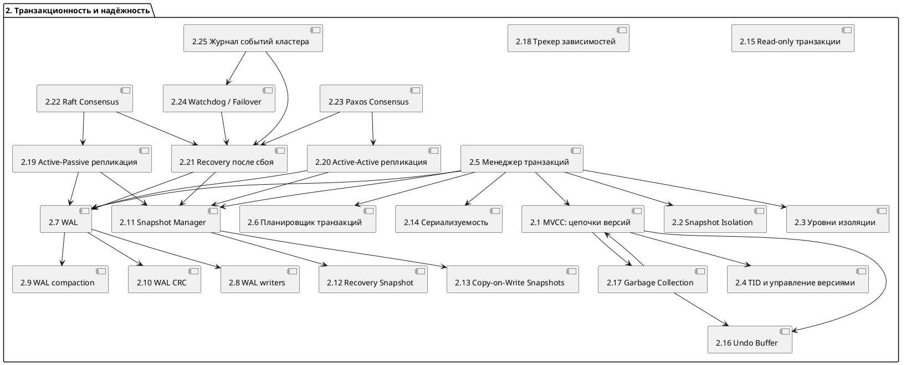

---

### 📎 Готово для Пакета 2

Ты можешь:

* Запросить PNG/SVG-рендер диаграммы
* Перейти к **Пакету 3 — SQL Ядро и оптимизация**
* Попросить таблицу входящих/исходящих связей по блоку

Жду твою команду.

Отлично, переходим к **📦 Пакету 3 — SQL Ядро и оптимизация**.

---

## 🧩 Этап 1: Список блоков пакета 3 (напоминание)

| ID   | Название блока                              |
| ---- | ------------------------------------------- |
| 3.1  | Ядро SQL-парсера ANSI SQL:2011+             |
| 3.2  | Обработка SELECT / INSERT / UPDATE / DELETE |
| 3.3  | MERGE / UPSERT / ON CONFLICT                |
| 3.4  | Оконные функции                             |
| 3.5  | Рекурсивные CTE (WITH RECURSIVE)            |
| 3.6  | Поддержка подзапросов и LATERAL             |
| 3.7  | Агрегации и GROUP BY                        |
| 3.8  | Аналитические функции                       |
| 3.9  | JSON-функции в SQL                          |
| 3.10 | MATCH\_RECOGNIZE                            |
| 3.11 | Генерация временных рядов                   |
| 3.12 | Стоимостной оптимизатор                     |
| 3.13 | Статистика, NDV, гистограммы                |
| 3.14 | Переупорядочивание JOIN’ов                  |
| 3.15 | Projection pruning и pushdown               |
| 3.16 | Упрощение выражений и предикатов            |
| 3.17 | Адаптивный re-optimizer                     |
| 3.18 | Построение и кэширование плана              |
| 3.19 | Интерпретатор SQL-плана                     |
| 3.20 | DSL для транзакций (в стиле PL/SQL)         |
| 3.21 | Поддержка UDF / UDAF                        |
| 3.22 | Встроенный процедурный язык                 |
| 3.23 | Хранимые процедуры и триггеры               |
| 3.24 | AST-интерпретация SQL                       |
| 3.25 | Exec hooks и inline-функции                 |

---

## 🔗 Этап 2: Логические связи между блоками

* \[3.1] → \[3.2–3.6], \[3.9], \[3.20], \[3.24]
* \[3.2–3.6] → \[3.12], \[3.7], \[3.8], \[3.14–3.16]
* \[3.12] → \[3.13], \[3.14], \[3.15], \[3.16]
* \[3.17] → \[3.12], \[3.18]
* \[3.18] → \[3.19], \[3.24]
* \[3.20] → \[3.21–3.23], \[3.25]

---

## 📈 Этап 3: PlantUML — Пакет 3 (SQL и оптимизация)

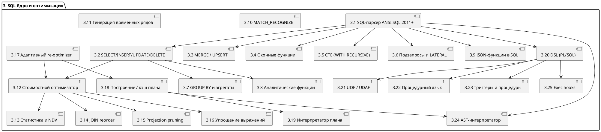

---

### ✅ Пакет 3 готов

Могу:

* Сформировать SVG / PNG / PDF
* Перейти к **Пакету 4 — Интерфейсы и интеграции**
* Построить таблицу связей блоков

Жду твою команду.

Переходим к **📦 Пакету 4 — Интерфейсы и интеграции**.

---

## 🧩 Этап 1: Список блоков пакета 4 (напоминание)

| ID   | Название блока                  |
| ---- | ------------------------------- |
| 4.1  | JDBC-драйвер                    |
| 4.2  | ODBC-драйвер                    |
| 4.3  | CLI-интерфейс                   |
| 4.4  | REST API                        |
| 4.5  | gRPC API                        |
| 4.6  | WebSocket API                   |
| 4.7  | GraphQL API                     |
| 4.8  | JSON\:API совместимость         |
| 4.9  | Поддержка CDC                   |
| 4.10 | Kafka-интеграция                |
| 4.11 | Pulsar-интеграция               |
| 4.12 | Debezium-интеграция             |
| 4.13 | Redis Streams                   |
| 4.14 | Changefeed API                  |
| 4.15 | Загрузка CSV                    |
| 4.16 | Загрузка JSON                   |
| 4.17 | Загрузка Parquet                |
| 4.18 | Загрузка Excel                  |
| 4.19 | Загрузка XML                    |
| 4.20 | Загрузка из S3                  |
| 4.21 | Webhooks                        |
| 4.22 | Внешние процедуры               |
| 4.23 | Асинхронные обработчики событий |
| 4.24 | Интеграция с ERP                |
| 4.25 | Интеграция с BPMN               |

---

## 🔗 Этап 2: Логические связи между блоками

* \[4.1–4.3] → ядро SQL (\[3.2])
* \[4.4–4.7] → \[4.8 JSON\:API]
* \[4.9] → \[4.10–4.14]
* \[4.15–4.20] → ядро импорта/ETL
* \[4.21–4.23] → \[4.4–4.6]
* \[4.24–4.25] → \[4.22 Внешние процедуры]

---

## 📈 Этап 3: PlantUML — Пакет 4 (интерфейсы и интеграции)

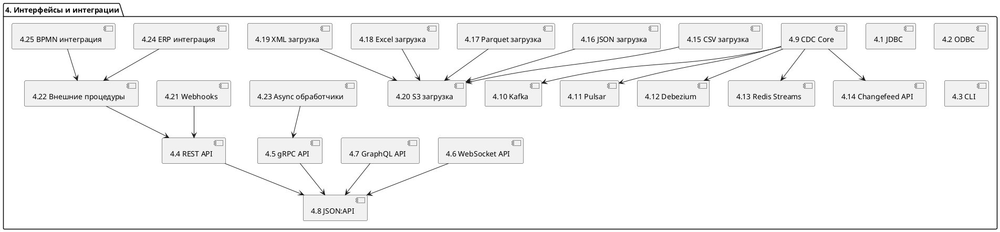

---

### ✅ Пакет 4 завершён

Готов:

* Перейти к **Пакету 5 — BI, ML и OLAP**
* Вывести визуализацию (SVG)
* Сгенерировать таблицу связей

Жду команду.

Переходим к **📦 Пакету 5 — BI, ML и OLAP**.

---

## 🧩 Этап 1: Список блоков пакета 5

| ID   | Название блока                                         |
| ---- | ------------------------------------------------------ |
| 5.1  | Поддержка HTAP-нагрузки                                |
| 5.2  | Материализованные представления                        |
| 5.3  | Кубы и pre-aggregated модели                           |
| 5.4  | ROLLUP, CUBE, GROUPING SETS                            |
| 5.5  | Адаптивные агрегаты                                    |
| 5.6  | Кэширование агрегированных данных                      |
| 5.7  | Временные окна и скользящие агрегаты                   |
| 5.8  | Типы и операции временных рядов                        |
| 5.9  | Gap-filling и генерация интервалов                     |
| 5.10 | Downsampling и агрегирование по времени                |
| 5.11 | Политики хранения временных данных                     |
| 5.12 | Прогнозирование трендов                                |
| 5.13 | Корреляционный и регрессионный анализ                  |
| 5.14 | Кластеризация и сегментация                            |
| 5.15 | RANK, NTILE, DENSE\_RANK и другие функции ранжирования |
| 5.16 | Поддержка ONNX                                         |
| 5.17 | Интеграция с TensorFlow                                |
| 5.18 | Интеграция с PyTorch                                   |
| 5.19 | SQL-инференс моделей                                   |
| 5.20 | Runtime API для инференса                              |
| 5.21 | Percentiles, median, mode                              |
| 5.22 | Классификация и регрессия                              |
| 5.23 | Доверительные интервалы и ошибки                       |
| 5.24 | Интерфейсы BI-инструментов                             |
| 5.25 | Интеграция с PowerBI, Tableau и др.                    |

---

## 🔗 Этап 2: Логические связи между блоками

* \[5.1] → \[5.2–5.6], \[5.8–5.10]
* \[5.2] → \[5.3], \[5.6]
* \[5.4] → \[5.5], \[5.6]
* \[5.8] → \[5.9], \[5.10], \[5.11]
* \[5.12–5.14] → \[5.19]
* \[5.16–5.18] → \[5.19] → \[5.20]
* \[5.24] → \[5.2], \[5.3], \[5.6]

---

## 📈 Этап 3: PlantUML — Пакет 5 (BI, ML и OLAP)

```plantuml
@startuml
package "5. BI, ML и OLAP" {
  [5.1 HTAP-нагрузка]
  [5.2 Материализованные представления]
  [5.3 Кубы и агрегаты]
  [5.4 ROLLUP / CUBE / GROUPING SETS]
  [5.5 Адаптивные агрегаты]
  [5.6 Кэш агрегатов]
  [5.7 Временные окна]
  [5.8 Типы временных рядов]
  [5.9 Gap-filling]
  [5.10 Downsampling]
  [5.11 Retention политики]
  [5.12 Прогнозирование]
  [5.13 Корреляции / Регрессии]
  [5.14 Кластеризация]
  [5.15 RANK / NTILE / DENSE_RANK]
  [5.16 ONNX поддержка]
  [5.17 TensorFlow интеграция]
  [5.18 PyTorch интеграция]
  [5.19 SQL-инференс]
  [5.20 ML Runtime API]
  [5.21 Percentiles / Median]
  [5.22 Классификация / Регрессия]
  [5.23 Доверительные интервалы]
  [5.24 Интерфейс BI-инструментов]
  [5.25 Интеграция Tableau / PowerBI]
}

' Основные связи
[5.1 HTAP-нагрузка] --> [5.2 Материализованные представления]
[5.1 HTAP-нагрузка] --> [5.3 Кубы и агрегаты]
[5.1 HTAP-нагрузка] --> [5.4 ROLLUP / CUBE / GROUPING SETS]
[5.1 HTAP-нагрузка] --> [5.5 Адаптивные агрегаты]
[5.1 HTAP-нагрузка] --> [5.6 Кэш агрегатов]
[5.1 HTAP-нагрузка] --> [5.8 Типы временных рядов]

[5.2 Материализованные представления] --> [5.3 Кубы и агрегаты]
[5.2 Материализованные представления] --> [5.6 Кэш агрегатов]

[5.4 ROLLUP / CUBE / GROUPING SETS] --> [5.5 Адаптивные агрегаты]
[5.5 Адаптивные агрегаты] --> [5.6 Кэш агрегатов]

[5.8 Типы временных рядов] --> [5.9 Gap-filling]
[5.8 Типы временных рядов] --> [5.10 Downsampling]
[5.8 Типы временных рядов] --> [5.11 Retention политики]

[5.12 Прогнозирование] --> [5.19 SQL-инференс]
[5.13 Корреляции / Регрессии] --> [5.19 SQL-инференс]
[5.14 Кластеризация] --> [5.19 SQL-инференс]

[5.16 ONNX поддержка] --> [5.19 SQL-инференс]
[5.17 TensorFlow интеграция] --> [5.19 SQL-инференс]
[5.18 PyTorch интеграция] --> [5.19 SQL-инференс]
[5.19 SQL-инференс] --> [5.20 ML Runtime API]

[5.24 Интерфейс BI-инструментов] --> [5.2 Материализованные представления]
[5.24 Интерфейс BI-инструментов] --> [5.3 Кубы и агрегаты]
[5.24 Интерфейс BI-инструментов] --> [5.6 Кэш агрегатов]
[5.25 Интеграция Tableau / PowerBI] --> [5.24 Интерфейс BI-инструментов]
@enduml
```

---

### ✅ Пакет 5 завершён

Могу:

* Перейти к **Пакету 6 — Безопасность**
* Вывести SVG/PNG/PDF
* Сформировать таблицу зависимостей

Жду твою команду.

Переходим к **📦 Пакету 6 — Безопасность**.

---

## 🧩 Этап 1: Список блоков пакета 6

| ID   | Название блока                                            |
| ---- | --------------------------------------------------------- |
| 6.1  | Ролевая модель доступа (RBAC)                             |
| 6.2  | Атрибутная модель доступа (ABAC)                          |
| 6.3  | Безопасность на уровне строк                              |
| 6.4  | Безопасность на уровне колонок                            |
| 6.5  | TLS, mTLS, JWT                                            |
| 6.6  | Шифрование на диске (TDE)                                 |
| 6.7  | Forward secrecy и ротация ключей                          |
| 6.8  | Аутентификация по логину, сертификатам и токенам          |
| 6.9  | ACL: фильтрация по IP, интерфейсу                         |
| 6.10 | Scoped tokens и ограничения на сессию                     |
| 6.11 | Аудит DDL/DML операций                                    |
| 6.12 | Immutable журнал аудита                                   |
| 6.13 | Цепочка доверия и цифровые подписи                        |
| 6.14 | Политики доступа к данным                                 |
| 6.15 | Access Policy Engine                                      |
| 6.16 | Контроль UDF/процедур по ролям                            |
| 6.17 | Песочница для Lua/JS/C UDF                                |
| 6.18 | Защита от SQL-инъекций                                    |
| 6.19 | Изоляция сессий                                           |
| 6.20 | Завершение неактивных сессий                              |
| 6.21 | Поддержка политик GDPR/HIPAA                              |
| 6.22 | Ротация паролей и ключей                                  |
| 6.23 | Обнаружение аномалий и вторжений                          |
| 6.24 | Внешние механизмы аутентификации (LDAP, OAuth2, Kerberos) |
| 6.25 | Изоляция прав администратора (superuser isolation)        |

---

## 🔗 Этап 2: Логические связи между блоками

* \[6.1, 6.2] → \[6.3, 6.4, 6.14]
* \[6.8] → \[6.1], \[6.10], \[6.24]
* \[6.11] → \[6.12], \[6.13]
* \[6.15] → \[6.14], \[6.1], \[6.2]
* \[6.16, 6.17] → \[6.21]
* \[6.23] → \[6.11], \[6.18]
* \[6.25] → \[6.1], \[6.19], \[6.20]

---

## 📈 Этап 3: PlantUML — Пакет 6 (безопасность)

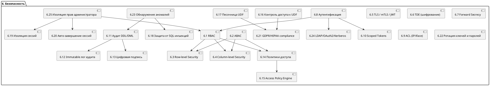

---

### ✅ Пакет 6 завершён

Хочешь:

* Перейти к **Пакету 7 — Observability и DevOps**?
* Сформировать SVG / таблицу связей?
  Жду команду.

Переходим к **📦 Пакету 7 — Observability и DevOps**.

---

## 🧩 Этап 1: Список блоков пакета 7

| ID   | Название блока                                |
| ---- | --------------------------------------------- |
| 7.1  | Система метрик (Prometheus, OpenMetrics)      |
| 7.2  | Метрики IOPS, latency, throughput             |
| 7.3  | Логирование: stderr, syslog, бинарный лог     |
| 7.4  | Трассировка: OpenTelemetry, Jaeger, Zipkin    |
| 7.5  | Query tracing и timeline                      |
| 7.6  | Flamegraph и профилировка                     |
| 7.7  | Structured logging (JSON, binary)             |
| 7.8  | Интеграция с perf и системным профилировщиком |
| 7.9  | Поддержка Alertmanager                        |
| 7.10 | REST API мониторинга                          |
| 7.11 | Веб-интерфейс мониторинга                     |
| 7.12 | CLI-инструменты мониторинга                   |
| 7.13 | Интеграция с CI/CD (GitHub Actions и др.)     |
| 7.14 | Mutation Testing                              |
| 7.15 | Покрытие кода (Coverage tracking)             |
| 7.16 | Fuzzing: libFuzzer, AFL++                     |
| 7.17 | Address/Thread Sanitizers                     |
| 7.18 | Fault Injection Framework                     |
| 7.19 | Chaos Testing                                 |
| 7.20 | Soak Testing                                  |
| 7.21 | Сравнение версий и деградаций                 |
| 7.22 | Логирование по сессиям и арендаторам          |
| 7.23 | Ротация и архивирование логов                 |
| 7.24 | Воспроизведение логов (replay engine)         |
| 7.25 | Профилирование критических участков           |

---

## 🔗 Этап 2: Логические связи между блоками

* \[7.1] → \[7.2], \[7.9], \[7.10–7.12]
* \[7.3] → \[7.7], \[7.22], \[7.23], \[7.24]
* \[7.4] → \[7.5], \[7.6], \[7.25]
* \[7.6] → \[7.8], \[7.25]
* \[7.13] → \[7.14–7.17], \[7.20]
* \[7.18–7.20] → \[7.21]

---

## 📈 Этап 3: PlantUML — Пакет 7 (наблюдаемость и DevOps)

```plantuml
@startuml
package "7. Observability и DevOps" {
  [7.1 Система метрик]
  [7.2 Метрики IOPS/latency]
  [7.3 Логирование stderr/syslog/bin]
  [7.4 Трассировка (OpenTelemetry)]
  [7.5 Query tracing]
  [7.6 Flamegraph / профилировка]
  [7.7 Structured logging]
  [7.8 Интеграция с perf]
  [7.9 Alertmanager]
  [7.10 REST мониторинг API]
  [7.11 Веб-интерфейс мониторинга]
  [7.12 CLI мониторинг]
  [7.13 CI/CD интеграция]
  [7.14 Mutation testing]
  [7.15 Покрытие кода]
  [7.16 Fuzzing: libFuzzer]
  [7.17 Sanitizers]
  [7.18 Fault Injection]
  [7.19 Chaos Testing]
  [7.20 Soak Testing]
  [7.21 Сравнение версий / деградаций]
  [7.22 Сессионное логирование]
  [7.23 Ротация логов]
  [7.24 Воспроизведение логов]
  [7.25 Профилирование узких мест]
}

[7.1 Система метрик] --> [7.2 Метрики IOPS/latency]
[7.1 Система метрик] --> [7.9 Alertmanager]
[7.1 Система метрик] --> [7.10 REST мониторинг API]
[7.1 Система метрик] --> [7.11 Веб-интерфейс мониторинга]
[7.1 Система метрик] --> [7.12 CLI мониторинг]

[7.3 Логирование stderr/syslog/bin] --> [7.7 Structured logging]
[7.3 Логирование stderr/syslog/bin] --> [7.22 Сессионное логирование]
[7.3 Логирование stderr/syslog/bin] --> [7.23 Ротация логов]
[7.3 Логирование stderr/syslog/bin] --> [7.24 Воспроизведение логов]

[7.4 Трассировка (OpenTelemetry)] --> [7.5 Query tracing]
[7.4 Трассировка (OpenTelemetry)] --> [7.6 Flamegraph / профилировка]
[7.4 Трассировка (OpenTelemetry)] --> [7.25 Профилирование узких мест]

[7.6 Flamegraph / профилировка] --> [7.8 Интеграция с perf]
[7.6 Flamegraph / профилировка] --> [7.25 Профилирование узких мест]

[7.13 CI/CD интеграция] --> [7.14 Mutation testing]
[7.13 CI/CD интеграция] --> [7.15 Покрытие кода]
[7.13 CI/CD интеграция] --> [7.16 Fuzzing: libFuzzer]
[7.13 CI/CD интеграция] --> [7.17 Sanitizers]
[7.13 CI/CD интеграция] --> [7.20 Soak Testing]

[7.18 Fault Injection] --> [7.21 Сравнение версий / деградаций]
[7.19 Chaos Testing] --> [7.21 Сравнение версий / деградаций]
[7.20 Soak Testing] --> [7.21 Сравнение версий / деградаций]
@enduml
```

---

### ✅ Пакет 7 завершён

Готов:

* Перейти к **Пакету 8 — Производительность и исполнение**
* Сформировать таблицу или визуализацию

Жду команду.

Переходим к **📦 Пакету 8 — Производительность и исполнение запросов**.

---

## 🧩 Этап 1: Список блоков пакета 8

| ID   | Название блока                               |
| ---- | -------------------------------------------- |
| 8.1  | Векторный движок исполнения                  |
| 8.2  | Параллельные пайплайны                       |
| 8.3  | Потоковая агрегация                          |
| 8.4  | Адаптивные алгоритмы JOIN                    |
| 8.5  | Выбор стратегии JOIN в рантайме              |
| 8.6  | Буферизация промежуточных результатов        |
| 8.7  | OLTP latency < 1 мс, critical query < 500 нс |
| 8.8  | SLA-анализ и прогноз времени выполнения      |
| 8.9  | Runtime re-optimization                      |
| 8.10 | Кэширование и пересборка плана               |
| 8.11 | Latency vs throughput-aware планирование     |
| 8.12 | Format-aware execution                       |
| 8.13 | Cardinality-driven оптимизация               |
| 8.14 | Профилировка исполнения                      |
| 8.15 | Устойчивость к пиковым нагрузкам             |
| 8.16 | Поддержка коротких транзакций                |
| 8.17 | NUMA-aware исполнение                        |
| 8.18 | Skew-aware join (горячие ключи)              |
| 8.19 | Использование Bloom-фильтров                 |
| 8.20 | Инкрементальное выполнение                   |
| 8.21 | Разделение CPU-bound и IO-bound операторов   |
| 8.22 | Приоритеты операторов в планировщике         |
| 8.23 | Copy-on-write структуры                      |
| 8.24 | Мгновенное клонирование таблиц               |
| 8.25 | Адаптивная выборка данных                    |

---

## 🔗 Этап 2: Логические связи между блоками

* \[8.1] → \[8.2], \[8.3], \[8.4], \[8.12]
* \[8.4] → \[8.5], \[8.13], \[8.18], \[8.19]
* \[8.10] → \[8.9], \[8.11], \[8.14]
* \[8.7] → \[8.8], \[8.15], \[8.16]
* \[8.21], \[8.22] → \[8.2], \[8.4]
* \[8.20] → \[8.6], \[8.25]

---

## 📈 Этап 3: PlantUML — Пакет 8 (исполнение и производительность)

```plantuml
@startuml
package "8. Производительность и исполнение" {
  [8.1 Векторный движок]
  [8.2 Параллельные пайплайны]
  [8.3 Потоковая агрегация]
  [8.4 Адаптивные JOIN]
  [8.5 JOIN runtime стратегия]
  [8.6 Буферизация результатов]
  [8.7 <1 мс latency / <500 нс крит.]
  [8.8 SLA-анализ]
  [8.9 Runtime re-optimization]
  [8.10 Кэш плана / пересборка]
  [8.11 Latency vs throughput]
  [8.12 Format-aware execution]
  [8.13 Cardinality optimization]
  [8.14 Профилировка исполнения]
  [8.15 Устойчивость к пикам]
  [8.16 Короткие транзакции]
  [8.17 NUMA-aware исполнение]
  [8.18 Skew-aware JOIN]
  [8.19 Bloom-фильтры]
  [8.20 Инкрементальное выполнение]
  [8.21 CPU/IO-bound separation]
  [8.22 Приоритеты операторов]
  [8.23 Copy-on-write]
  [8.24 Клонирование таблиц]
  [8.25 Адаптивная выборка]
}

[8.1 Векторный движок] --> [8.2 Параллельные пайплайны]
[8.1 Векторный движок] --> [8.3 Потоковая агрегация]
[8.1 Векторный движок] --> [8.4 Адаптивные JOIN]
[8.1 Векторный движок] --> [8.12 Format-aware execution]

[8.4 Адаптивные JOIN] --> [8.5 JOIN runtime стратегия]
[8.4 Адаптивные JOIN] --> [8.13 Cardinality optimization]
[8.4 Адаптивные JOIN] --> [8.18 Skew-aware JOIN]
[8.4 Адаптивные JOIN] --> [8.19 Bloom-фильтры]

[8.10 Кэш плана / пересборка] --> [8.9 Runtime re-optimization]
[8.10 Кэш плана / пересборка] --> [8.11 Latency vs throughput]
[8.10 Кэш плана / пересборка] --> [8.14 Профилировка исполнения]

[8.7 <1 мс latency / <500 нс крит.] --> [8.8 SLA-анализ]
[8.7 <1 мс latency / <500 нс крит.] --> [8.15 Устойчивость к пикам]
[8.7 <1 мс latency / <500 нс крит.] --> [8.16 Короткие транзакции]

[8.21 CPU/IO-bound separation] --> [8.2 Параллельные пайплайны]
[8.22 Приоритеты операторов] --> [8.4 Адаптивные JOIN]

[8.20 Инкрементальное выполнение] --> [8.6 Буферизация результатов]
[8.20 Инкрементальное выполнение] --> [8.25 Адаптивная выборка]
@enduml
```

---

### ✅ Пакет 8 завершён

Хочешь:

* Перейти к **Пакету 9 — Расширяемость и встраиваемость**?
* Вывести SVG/таблицу связей?

Жду команду.
Переходим к **📦 Пакету 9 — Расширяемость и встраиваемость**.

---

## 🧩 Этап 1: Список блоков пакета 9

| ID   | Название блока                                   |
| ---- | ------------------------------------------------ |
| 9.1  | Пользовательские функции (UDF/UDAF)              |
| 9.2  | Языки UDF: Lua, JS, C/C++, WASM                  |
| 9.3  | Песочница для выполнения UDF                     |
| 9.4  | REST / gRPC / JSON\:API внешние интерфейсы       |
| 9.5  | Расширения через dlopen / LoadLibrary            |
| 9.6  | Встроенный DSL для транзакций                    |
| 9.7  | Планировщик пользовательских задач               |
| 9.8  | Система плагинов                                 |
| 9.9  | Расширение SQL-синтаксиса                        |
| 9.10 | ETL-интеграция                                   |
| 9.11 | SQL-процедуры для управления внешними системами  |
| 9.12 | Хранимые правила и политики                      |
| 9.13 | Metadata discovery для API                       |
| 9.14 | UDF-доступ к данным (safe API)                   |
| 9.15 | Поддержка сериализации (JSON, MsgPack, Protobuf) |
| 9.16 | Callback API к событиям                          |
| 9.17 | Встраиваемый режим (embedded DB)                 |
| 9.18 | Расширяемые типы данных                          |
| 9.19 | Расширяемые агрегаты и оконные функции           |
| 9.20 | Скрипты Lua / JS                                 |
| 9.21 | Интеграция с внешними планировщиками             |
| 9.22 | Runtime перезагрузка UDF и расширений            |
| 9.23 | Расширение WAL и snapshot для внешних модулей    |
| 9.24 | Типизация параметров UDF                         |
| 9.25 | Транзакционная обёртка вокруг UDF                |

---

## 🔗 Этап 2: Логические связи между блоками

* \[9.1] → \[9.2], \[9.3], \[9.14], \[9.24]
* \[9.2] → \[9.20], \[9.3]
* \[9.5] → \[9.1], \[9.22]
* \[9.6] → \[9.7], \[9.11], \[9.12]
* \[9.8] → \[9.5], \[9.9], \[9.18], \[9.19]
* \[9.10] → \[9.11], \[9.21]
* \[9.23] → \[9.5], \[9.14]

---

## 📈 Этап 3: PlantUML — Пакет 9 (расширяемость и UDF)

```plantuml
@startuml
package "9. Расширяемость и встраиваемость" {
  [9.1 UDF / UDAF]
  [9.2 Языки UDF: Lua, JS, C, WASM]
  [9.3 Песочница UDF]
  [9.4 REST / gRPC / JSON:API]
  [9.5 Расширения dlopen/LoadLibrary]
  [9.6 DSL для транзакций]
  [9.7 Планировщик задач]
  [9.8 Система плагинов]
  [9.9 Расширение SQL-синтаксиса]
  [9.10 ETL-интеграция]
  [9.11 SQL для внешних систем]
  [9.12 Хранимые политики]
  [9.13 Metadata discovery API]
  [9.14 UDF доступ к данным]
  [9.15 Сериализация: JSON/Proto]
  [9.16 Callback API]
  [9.17 Embedded DB режим]
  [9.18 Расширяемые типы]
  [9.19 Расширяемые агрегаты]
  [9.20 Скрипты Lua/JS]
  [9.21 Интеграция с внешними планировщиками]
  [9.22 Runtime reload]
  [9.23 Расширение WAL/snapshot]
  [9.24 Типизация параметров]
  [9.25 Обёртка транзакций вокруг UDF]
}

[9.1 UDF / UDAF] --> [9.2 Языки UDF: Lua, JS, C, WASM]
[9.1 UDF / UDAF] --> [9.3 Песочница UDF]
[9.1 UDF / UDAF] --> [9.14 UDF доступ к данным]
[9.1 UDF / UDAF] --> [9.24 Типизация параметров]
[9.2 Языки UDF: Lua, JS, C, WASM] --> [9.20 Скрипты Lua/JS]
[9.2 Языки UDF: Lua, JS, C, WASM] --> [9.3 Песочница UDF]

[9.5 Расширения dlopen/LoadLibrary] --> [9.1 UDF / UDAF]
[9.5 Расширения dlopen/LoadLibrary] --> [9.22 Runtime reload]
[9.6 DSL для транзакций] --> [9.7 Планировщик задач]
[9.6 DSL для транзакций] --> [9.11 SQL для внешних систем]
[9.6 DSL для транзакций] --> [9.12 Хранимые политики]

[9.8 Система плагинов] --> [9.5 Расширения dlopen/LoadLibrary]
[9.8 Система плагинов] --> [9.9 Расширение SQL-синтаксиса]
[9.8 Система плагинов] --> [9.18 Расширяемые типы]
[9.8 Система плагинов] --> [9.19 Расширяемые агрегаты]

[9.10 ETL-интеграция] --> [9.11 SQL для внешних систем]
[9.10 ETL-интеграция] --> [9.21 Интеграция с внешними планировщиками]

[9.23 Расширение WAL/snapshot] --> [9.5 Расширения dlopen/LoadLibrary]
[9.23 Расширение WAL/snapshot] --> [9.14 UDF доступ к данным]
@enduml
```

---

### ✅ Пакет 9 завершён

Готов:

* Перейти к **Пакету 10 — Тестируемость и структура проекта**
* Экспортировать SVG или таблицу зависимостей

Жду твою команду.

Переходим к **📦 Пакету 10 — Тестируемость и структура проекта**.

---

## 🧩 Этап 1: Список блоков пакета 10

| ID    | Название блока                                 |
| ----- | ---------------------------------------------- |
| 10.1  | Unit-тестирование подсистем                    |
| 10.2  | Интеграционное тестирование                    |
| 10.3  | Fuzz-тестирование SQL / API / UDF              |
| 10.4  | Stress Testing                                 |
| 10.5  | Soak Testing                                   |
| 10.6  | Mutation Testing                               |
| 10.7  | Покрытие кода (Coverage tracking)              |
| 10.8  | Изоляция окружений / sandbox тестов            |
| 10.9  | Fault Injection Framework                      |
| 10.10 | Тестирование многопоточности                   |
| 10.11 | Генерация SQL-запросов (валидных и невалидных) |
| 10.12 | Проверка соответствия плана и результата       |
| 10.13 | Метрики стабильности и надёжности              |
| 10.14 | Проверка миграций схем                         |
| 10.15 | Имитация сбоев (kill, crash, reboot)           |
| 10.16 | WAL / Snapshot тесты                           |
| 10.17 | CI/CD: автопроверки                            |
| 10.18 | Поведение при нехватке ресурсов                |
| 10.19 | Моки и симуляторы внешнего окружения           |
| 10.20 | Поддержка тестовых фикстур                     |
| 10.21 | Визуализация результатов тестов (JUnit, HTML)  |
| 10.22 | Бенчмарки и сравнение версий                   |
| 10.23 | Проверка соответствия SAP HANA+                |
| 10.24 | Тестирование sandbox/песочниц (Lua/WASM)       |
| 10.25 | Структура проекта: каталоги и модули           |

---

## 🔗 Этап 2: Логические связи между блоками

* \[10.1–10.2] → \[10.6], \[10.7], \[10.22]
* \[10.3] → \[10.1], \[10.24]
* \[10.9] → \[10.4], \[10.5], \[10.15]
* \[10.14] → \[10.16], \[10.23]
* \[10.17] → \[10.6], \[10.7], \[10.21]
* \[10.25] — центральная основа проекта

---

## 📈 Этап 3: PlantUML — Пакет 10 (тестирование и структура)

```plantuml
@startuml
package "10. Тестируемость и структура проекта" {
  [10.1 Unit-тесты]
  [10.2 Интеграционные тесты]
  [10.3 Fuzz-тестирование]
  [10.4 Stress Testing]
  [10.5 Soak Testing]
  [10.6 Mutation Testing]
  [10.7 Покрытие кода]
  [10.8 Изоляция окружения]
  [10.9 Fault Injection]
  [10.10 Многопоточность]
  [10.11 Генерация SQL-запросов]
  [10.12 Проверка планов]
  [10.13 Метрики стабильности]
  [10.14 Проверка миграций схем]
  [10.15 Имитация сбоев]
  [10.16 Тесты WAL / Snapshot]
  [10.17 CI/CD автопроверки]
  [10.18 Тесты при нехватке ресурсов]
  [10.19 Моки и симуляторы]
  [10.20 Тестовые фикстуры]
  [10.21 Визуализация тестов]
  [10.22 Бенчмарки и сравнение]
  [10.23 Соответствие SAP HANA+]
  [10.24 Тестирование песочниц]
  [10.25 Структура каталогов / модулей]
}

[10.1 Unit-тесты] --> [10.6 Mutation Testing]
[10.1 Unit-тесты] --> [10.7 Покрытие кода]
[10.1 Unit-тесты] --> [10.22 Бенчмарки и сравнение]

[10.2 Интеграционные тесты] --> [10.6 Mutation Testing]
[10.2 Интеграционные тесты] --> [10.22 Бенчмарки и сравнение]

[10.3 Fuzz-тестирование] --> [10.1 Unit-тесты]
[10.3 Fuzz-тестирование] --> [10.24 Тестирование песочниц]

[10.9 Fault Injection] --> [10.4 Stress Testing]
[10.9 Fault Injection] --> [10.5 Soak Testing]
[10.9 Fault Injection] --> [10.15 Имитация сбоев]

[10.14 Проверка миграций схем] --> [10.16 Тесты WAL / Snapshot]
[10.14 Проверка миграций схем] --> [10.23 Соответствие SAP HANA+]

[10.17 CI/CD автопроверки] --> [10.6 Mutation Testing]
[10.17 CI/CD автопроверки] --> [10.7 Покрытие кода]
[10.17 CI/CD автопроверки] --> [10.21 Визуализация тестов]

[10.25 Структура каталогов / модулей] --> [10.1 Unit-тесты]
[10.25 Структура каталогов / модулей] --> [10.2 Интеграционные тесты]
@enduml
```

---

### ✅ Пакет 10 завершён

Могу:

* Перейти к **Пакету 11 — Типы данных и форматы**
* Сгенерировать таблицу зависимостей
* Экспортировать визуализацию

Жду команду.

Переходим к **📦 Пакету 11 — Типы данных и форматы хранения**.

---

## 🧩 Этап 1: Список блоков пакета 11

| ID    | Название блока                                    |
| ----- | ------------------------------------------------- |
| 11.1  | Базовые типы: int, float, bool, string            |
| 11.2  | Decimal / Numeric / Money                         |
| 11.3  | Дата и время: DATE / TIME / TIMESTAMP             |
| 11.4  | TIMESTAMP с наносекундной точностью               |
| 11.5  | INTERVAL и арифметика времени                     |
| 11.6  | JSON и вложенные структуры                        |
| 11.7  | Массивы и многомерные структуры                   |
| 11.8  | ENUM и ограниченные множества                     |
| 11.9  | Пользовательские типы данных                      |
| 11.10 | NULL-логика и 3-значная типизация                 |
| 11.11 | UUID                                              |
| 11.12 | Бинарные данные: BYTEA / BLOB                     |
| 11.13 | Bitmask и логические типы                         |
| 11.14 | Композитные типы (record/struct)                  |
| 11.15 | Геопространственные типы (опционально)            |
| 11.16 | Типы временных рядов                              |
| 11.17 | Сериализация: JSON / XML / Proto / Avro / Parquet |
| 11.18 | Функции преобразования типов                      |
| 11.19 | Типизация параметров SQL и UDF                    |
| 11.20 | Автоопределение формата по MIME и расширению      |
| 11.21 | UTF-8 хранение строк                              |
| 11.22 | Сжатие строковых колонок                          |
| 11.23 | ICU collation и сортировка по локали              |
| 11.24 | Приведение и проверка совместимости типов         |
| 11.25 | Совместимость с PostgreSQL / Oracle               |

---

## 🔗 Этап 2: Логические связи между блоками

* \[11.1–11.5] → ядро типов
* \[11.6–11.9] → сложные и пользовательские типы
* \[11.17] → \[11.6], \[11.12], \[11.21]
* \[11.23] → \[11.21], \[11.22]
* \[11.24] → \[11.1–11.19]
* \[11.25] → \[11.2], \[11.3], \[11.8], \[11.14]

---

## 📈 Этап 3: PlantUML — Пакет 11 (типы и форматы)

```plantuml
@startuml
package "11. Типы данных и форматы хранения" {
  [11.1 Базовые типы: int/float/bool/string]
  [11.2 Decimal / Money]
  [11.3 DATE / TIME / TIMESTAMP]
  [11.4 TIMESTAMP (ns)]
  [11.5 INTERVAL]
  [11.6 JSON / вложенные структуры]
  [11.7 Массивы]
  [11.8 ENUM / множества]
  [11.9 Пользовательские типы]
  [11.10 NULL и 3-значная логика]
  [11.11 UUID]
  [11.12 BYTEA / BLOB]
  [11.13 Bitmask / логика]
  [11.14 Композитные типы]
  [11.15 Гео-тип (optional)]
  [11.16 Типы временных рядов]
  [11.17 Сериализация: JSON/XML/Proto]
  [11.18 Преобразование типов]
  [11.19 Типизация SQL / UDF параметров]
  [11.20 MIME формат auto-определение]
  [11.21 UTF-8 строки]
  [11.22 Сжатие строк]
  [11.23 ICU сортировка / локали]
  [11.24 Проверка совместимости типов]
  [11.25 Совместимость PostgreSQL/Oracle]
}

[11.6 JSON / вложенные структуры] --> [11.17 Сериализация: JSON/XML/Proto]
[11.12 BYTEA / BLOB] --> [11.17 Сериализация: JSON/XML/Proto]
[11.21 UTF-8 строки] --> [11.22 Сжатие строк]
[11.21 UTF-8 строки] --> [11.23 ICU сортировка / локали]

[11.1 Базовые типы: int/float/bool/string] --> [11.24 Проверка совместимости типов]
[11.2 Decimal / Money] --> [11.24 Проверка совместимости типов]
[11.3 DATE / TIME / TIMESTAMP] --> [11.24 Проверка совместимости типов]
[11.4 TIMESTAMP (ns)] --> [11.24 Проверка совместимости типов]
[11.5 INTERVAL] --> [11.24 Проверка совместимости типов]
[11.6 JSON / вложенные структуры] --> [11.24 Проверка совместимости типов]
[11.8 ENUM / множества] --> [11.24 Проверка совместимости типов]
[11.9 Пользовательские типы] --> [11.24 Проверка совместимости типов]
[11.10 NULL и 3-значная логика] --> [11.24 Проверка совместимости типов]
[11.11 UUID] --> [11.24 Проверка совместимости типов]
[11.13 Bitmask / логика] --> [11.24 Проверка совместимости типов]
[11.14 Композитные типы] --> [11.24 Проверка совместимости типов]
[11.16 Типы временных рядов] --> [11.24 Проверка совместимости типов]

[11.25 Совместимость PostgreSQL/Oracle] --> [11.2 Decimal / Money]
[11.25 Совместимость PostgreSQL/Oracle] --> [11.3 DATE / TIME / TIMESTAMP]
[11.25 Совместимость PostgreSQL/Oracle] --> [11.8 ENUM / множества]
[11.25 Совместимость PostgreSQL/Oracle] --> [11.14 Композитные типы]
@enduml
```

---

### ✅ Пакет 11 завершён

Хочешь:

* Перейти к **Пакету 12 — Эволюция схем и миграции**
* Вывести визуализацию / таблицу связей

Жду команду.

Переходим к **📦 Пакету 12 — Эволюция схем и миграции данных**.

---

## 🧩 Этап 1: Список блоков пакета 12

| ID    | Название блока                          |
| ----- | --------------------------------------- |
| 12.1  | Механизм миграции схем (DDL engine)     |
| 12.2  | ONLINE ALTER TABLE                      |
| 12.3  | Обратимые изменения схем (rollback)     |
| 12.4  | Миграции без перезапуска                |
| 12.5  | Сравнение схем (diff engine)            |
| 12.6  | Совместимость версий таблиц и индексов  |
| 12.7  | Журнал изменений схем                   |
| 12.8  | AS OF запросы к схемам                  |
| 12.9  | SYSTEM VERSIONED таблицы                |
| 12.10 | Snapshot версионирование схем           |
| 12.11 | Изменения индексов без пересоздания     |
| 12.12 | Добавление/удаление колонок online      |
| 12.13 | Миграции типов с преобразованием        |
| 12.14 | Миграции партиционированных таблиц      |
| 12.15 | Переименование объектов без блокировок  |
| 12.16 | Миграции внешних ключей и связей        |
| 12.17 | Контроль ссылочной целостности          |
| 12.18 | Миграции UDF/триггеров/процедур         |
| 12.19 | Миграции в мультиарендных системах      |
| 12.20 | Совместимость API и схем (compat layer) |
| 12.21 | Проверка миграций в CI (dry-run)        |
| 12.22 | Визуализация миграций и зависимостей    |
| 12.23 | ONLINE миграции в кластере              |
| 12.24 | Раскатка миграций в шардах              |
| 12.25 | Откат миграции при сбое                 |

---

## 🔗 Этап 2: Логические связи между блоками

* \[12.1] → \[12.2], \[12.3], \[12.4], \[12.5], \[12.11], \[12.12]
* \[12.5] → \[12.6], \[12.22]
* \[12.9] → \[12.8], \[12.10]
* \[12.18] → \[12.19], \[12.20]
* \[12.23] → \[12.24], \[12.25]
* \[12.21] → \[12.1], \[12.5], \[12.22]

---

## 📈 Этап 3: PlantUML — Пакет 12 (миграции и эволюция схем)

```plantuml
@startuml
package "12. Эволюция схем и миграции" {
  [12.1 DDL Engine (миграции)]
  [12.2 ONLINE ALTER TABLE]
  [12.3 Rollback миграций]
  [12.4 Без перезапуска]
  [12.5 Сравнение схем]
  [12.6 Совместимость версий]
  [12.7 Журнал изменений схем]
  [12.8 AS OF по схеме]
  [12.9 SYSTEM VERSIONED]
  [12.10 Snapshot версионность]
  [12.11 Индексы без пересоздания]
  [12.12 Add/Drop колонок ONLINE]
  [12.13 Миграции типов]
  [12.14 Миграции партиций]
  [12.15 Переименование объектов]
  [12.16 Внешние ключи]
  [12.17 Ссылочная целостность]
  [12.18 Миграции UDF и процедур]
  [12.19 Миграции в multi-tenant]
  [12.20 Совместимость API/Schema]
  [12.21 Проверка миграций (dry run)]
  [12.22 Визуализация зависимостей]
  [12.23 ONLINE миграции в кластере]
  [12.24 Раскатка в шардированных таблицах]
  [12.25 Откат миграций при сбое]
}

[12.1 DDL Engine (миграции)] --> [12.2 ONLINE ALTER TABLE]
[12.1 DDL Engine (миграции)] --> [12.3 Rollback миграций]
[12.1 DDL Engine (миграции)] --> [12.4 Без перезапуска]
[12.1 DDL Engine (миграции)] --> [12.5 Сравнение схем]
[12.1 DDL Engine (миграции)] --> [12.11 Индексы без пересоздания]
[12.1 DDL Engine (миграции)] --> [12.12 Add/Drop колонок ONLINE]

[12.5 Сравнение схем] --> [12.6 Совместимость версий]
[12.5 Сравнение схем] --> [12.22 Визуализация зависимостей]

[12.9 SYSTEM VERSIONED] --> [12.8 AS OF по схеме]
[12.9 SYSTEM VERSIONED] --> [12.10 Snapshot версионность]

[12.18 Миграции UDF и процедур] --> [12.19 Миграции в multi-tenant]
[12.18 Миграции UDF и процедур] --> [12.20 Совместимость API/Schema]

[12.23 ONLINE миграции в кластере] --> [12.24 Раскатка в шардированных таблицах]
[12.23 ONLINE миграции в кластере] --> [12.25 Откат миграций при сбое]

[12.21 Проверка миграций (dry run)] --> [12.1 DDL Engine (миграции)]
[12.21 Проверка миграций (dry run)] --> [12.5 Сравнение схем]
[12.21 Проверка миграций (dry run)] --> [12.22 Визуализация зависимостей]
@enduml
```

---

### ✅ Пакет 12 завершён

Могу:

* Перейти к **Пакету 13 — Планировка, очереди и диспетчеризация**
* Сгенерировать SVG/таблицу зависимостей

Жду команду.

Переходим к **📦 Пакету 13 — Внутренняя планировка, очереди и диспетчеризация**.

---

## 🧩 Этап 1: Список блоков пакета 13

| ID    | Название блока                                       |
| ----- | ---------------------------------------------------- |
| 13.1  | Планировщик задач (scheduler)                        |
| 13.2  | Очереди фоновых задач и балансировка                 |
| 13.3  | Очереди с приоритетами и SLA                         |
| 13.4  | Распределённый планировщик (distributed planner)     |
| 13.5  | Планирование snapshot/WAL/GC/flush                   |
| 13.6  | Планирование IO-потоков                              |
| 13.7  | Балансировка фоновых потоков                         |
| 13.8  | Мониторинг очередей                                  |
| 13.9  | Очереди задач для UDF/внешних функций                |
| 13.10 | Автоматическое масштабирование (autoscaling)         |
| 13.11 | Resource groups: CPU/Memory per сессия               |
| 13.12 | Диспетчер транзакций по потокам                      |
| 13.13 | Координация background workers                       |
| 13.14 | Асинхронное выполнение SQL                           |
| 13.15 | Планирование в NUMA-окружении                        |
| 13.16 | Flush WAL и snapshot по очереди                      |
| 13.17 | Отложенное выполнение и батчинг                      |
| 13.18 | Очереди блокировок                                   |
| 13.19 | Транзакции в партициях                               |
| 13.20 | Cron / interval / triggered задания                  |
| 13.21 | QoS для OLTP / OLAP потоков                          |
| 13.22 | Dependency-aware scheduling                          |
| 13.23 | Входящие очереди запросов                            |
| 13.24 | Блокирующие и зависшие задачи: обнаружение           |
| 13.25 | Интеграция с внешними планировщиками (Airflow и др.) |

---

## 🔗 Этап 2: Логические связи между блоками

* \[13.1] → \[13.2–13.5], \[13.7], \[13.13]
* \[13.4] → \[13.1], \[13.22]
* \[13.2] → \[13.6], \[13.8], \[13.9]
* \[13.10] → \[13.2], \[13.11]
* \[13.12] → \[13.18], \[13.19]
* \[13.14] → \[13.17], \[13.20], \[13.23]
* \[13.25] → \[13.1], \[13.20]

---

## 📈 Этап 3: PlantUML — Пакет 13 (очереди и планировка)

```plantuml
@startuml
package "13. Планировка, очереди и диспетчеризация" {
  [13.1 Планировщик задач]
  [13.2 Очереди фоновых задач]
  [13.3 Приоритетные очереди / SLA]
  [13.4 Распределённый планировщик]
  [13.5 Планирование snapshot/WAL/GC]
  [13.6 IO поток планировщик]
  [13.7 Балансировка фоновых потоков]
  [13.8 Мониторинг очередей]
  [13.9 Очереди для UDF/внешних]
  [13.10 Автомасштабирование]
  [13.11 Resource groups (CPU/Memory)]
  [13.12 Диспетчер транзакций]
  [13.13 Background workers]
  [13.14 Async SQL выполнение]
  [13.15 NUMA-aware планировка]
  [13.16 Очереди flush WAL/snapshot]
  [13.17 Отложенное выполнение / batching]
  [13.18 Очереди блокировок]
  [13.19 Транзакции в партициях]
  [13.20 Cron / interval задания]
  [13.21 QoS для OLTP/OLAP]
  [13.22 Dependency-aware планирование]
  [13.23 Входящие очереди запросов]
  [13.24 Блокирующие задачи: detection]
  [13.25 Внешние планировщики (Airflow)]
}

[13.1 Планировщик задач] --> [13.2 Очереди фоновых задач]
[13.1 Планировщик задач] --> [13.3 Приоритетные очереди / SLA]
[13.1 Планировщик задач] --> [13.5 Планирование snapshot/WAL/GC]
[13.1 Планировщик задач] --> [13.7 Балансировка фоновых потоков]
[13.1 Планировщик задач] --> [13.13 Background workers]

[13.4 Распределённый планировщик] --> [13.1 Планировщик задач]
[13.4 Распределённый планировщик] --> [13.22 Dependency-aware планирование]

[13.2 Очереди фоновых задач] --> [13.6 IO поток планировщик]
[13.2 Очереди фоновых задач] --> [13.8 Мониторинг очередей]
[13.2 Очереди фоновых задач] --> [13.9 Очереди для UDF/внешних]

[13.10 Автомасштабирование] --> [13.2 Очереди фоновых задач]
[13.10 Автомасштабирование] --> [13.11 Resource groups (CPU/Memory)]

[13.12 Диспетчер транзакций] --> [13.18 Очереди блокировок]
[13.12 Диспетчер транзакций] --> [13.19 Транзакции в партициях]

[13.14 Async SQL выполнение] --> [13.17 Отложенное выполнение / batching]
[13.14 Async SQL выполнение] --> [13.20 Cron / interval задания]
[13.14 Async SQL выполнение] --> [13.23 Входящие очереди запросов]

[13.25 Внешние планировщики (Airflow)] --> [13.1 Планировщик задач]
[13.25 Внешние планировщики (Airflow)] --> [13.20 Cron / interval задания]
@enduml
```

---

### ✅ Пакет 13 завершён

Готов:

* Перейти к **Пакету 14 — Горячие / холодные данные, auto-tiering, TTL**
* Экспортировать в SVG / таблицу связей

Жду команду.

Переходим к **📦 Пакету 14 — Горячие / холодные данные, auto-tiering и TTL**.

---

## 🧩 Этап 1: Список блоков пакета 14

| ID    | Название блока                             |
| ----- | ------------------------------------------ |
| 14.1  | Детектор горячих / холодных данных         |
| 14.2  | Политики auto-tiering                      |
| 14.3  | Tiered Storage: DRAM / NVMe / SSD / архив  |
| 14.4  | TTL политики на строки / колонки / таблицы |
| 14.5  | Поддержка expiration timestamp             |
| 14.6  | Batch-эвакуация устаревших данных          |
| 14.7  | LRU / LFU / ARC eviction policies          |
| 14.8  | SQL-интерфейс для TTL                      |
| 14.9  | TTL-aware индексы                          |
| 14.10 | TTL-aware MVCC chain traversal             |
| 14.11 | TTL для snapshot и агрегатов               |
| 14.12 | TTL в UDF                                  |
| 14.13 | Интеграция TTL с вакуумом и сжатием        |
| 14.14 | Временные таблицы с auto-drop              |
| 14.15 | Температурный скоринг hotness score        |
| 14.16 | Tier-aware memory allocator                |
| 14.17 | Автоматическая предзагрузка hot-страниц    |
| 14.18 | Гибридное хранение сегментов (DRAM + SSD)  |
| 14.19 | TTL по access/modify/create time           |
| 14.20 | TTL в JSON-полях и вложенных объектах      |
| 14.21 | Асинхронная утилизация холодных сегментов  |
| 14.22 | Archive-партиции и медленное хранилище     |
| 14.23 | Метрики TTL: удалений, частота, охват      |
| 14.24 | Планирование TTL-сканирований              |
| 14.25 | TTL-совместимые snapshot и AS OF           |

---

## 🔗 Этап 2: Логические связи между блоками

* \[14.1] → \[14.2], \[14.15], \[14.17]
* \[14.2] → \[14.3], \[14.16], \[14.18], \[14.21]
* \[14.4] → \[14.5], \[14.8], \[14.9], \[14.10], \[14.13], \[14.24]
* \[14.6] → \[14.21], \[14.23]
* \[14.13] → \[14.11], \[14.12]
* \[14.14] → \[14.4], \[14.19]
* \[14.25] → \[14.10], \[14.11]

---

## 📈 Этап 3: PlantUML — Пакет 14 (горячие/холодные данные, TTL, auto-tiering)

```plantuml
@startuml
package "14. Горячие / холодные данные, auto-tiering, TTL" {
  [14.1 Детектор hot/cold]
  [14.2 Политики auto-tiering]
  [14.3 Tiered Storage (DRAM/SSD)]
  [14.4 TTL политики]
  [14.5 Expiration timestamps]
  [14.6 Batch эвакуация]
  [14.7 Eviction: LRU/LFU/ARC]
  [14.8 SQL-интерфейс TTL]
  [14.9 TTL-aware индексы]
  [14.10 TTL-aware MVCC обход]
  [14.11 TTL для snapshot/агрегатов]
  [14.12 TTL в UDF]
  [14.13 Интеграция с vacuum / сжатием]
  [14.14 Временные таблицы]
  [14.15 Hotness score]
  [14.16 Tier-aware аллокатор]
  [14.17 Предзагрузка hot-страниц]
  [14.18 Гибридное DRAM+SSD хранение]
  [14.19 TTL по времени доступа]
  [14.20 TTL в JSON полях]
  [14.21 Асинхронная утилизация]
  [14.22 Archive-партиции]
  [14.23 Метрики TTL]
  [14.24 Планирование TTL-сканирований]
  [14.25 TTL-совместимые snapshot'ы]
}

[14.1 Детектор hot/cold] --> [14.2 Политики auto-tiering]
[14.1 Детектор hot/cold] --> [14.15 Hotness score]
[14.1 Детектор hot/cold] --> [14.17 Предзагрузка hot-страниц]

[14.2 Политики auto-tiering] --> [14.3 Tiered Storage (DRAM/SSD)]
[14.2 Политики auto-tiering] --> [14.16 Tier-aware аллокатор]
[14.2 Политики auto-tiering] --> [14.18 Гибридное DRAM+SSD хранение]
[14.2 Политики auto-tiering] --> [14.21 Асинхронная утилизация]

[14.4 TTL политики] --> [14.5 Expiration timestamps]
[14.4 TTL политики] --> [14.8 SQL-интерфейс TTL]
[14.4 TTL политики] --> [14.9 TTL-aware индексы]
[14.4 TTL политики] --> [14.10 TTL-aware MVCC обход]
[14.4 TTL политики] --> [14.13 Интеграция с vacuum / сжатием]
[14.4 TTL политики] --> [14.24 Планирование TTL-сканирований]

[14.6 Batch эвакуация] --> [14.21 Асинхронная утилизация]
[14.6 Batch эвакуация] --> [14.23 Метрики TTL]

[14.13 Интеграция с vacuum / сжатием] --> [14.11 TTL для snapshot/агрегатов]
[14.13 Интеграция с vacuum / сжатием] --> [14.12 TTL в UDF]

[14.14 Временные таблицы] --> [14.4 TTL политики]
[14.14 Временные таблицы] --> [14.19 TTL по времени доступа]

[14.25 TTL-совместимые snapshot'ы] --> [14.10 TTL-aware MVCC обход]
[14.25 TTL-совместимые snapshot'ы] --> [14.11 TTL для snapshot/агрегатов]
@enduml
```

---

### ✅ Пакет 14 завершён

Хочешь:

* Перейти к **Пакету 15 — Репликация, кластер, отказоустойчивость**
* Получить SVG-диаграмму или таблицу связей

Жду твою команду.

Переходим к **📦 Пакету 15 — Репликация, отказоустойчивость и кластер**.

---

## 🧩 Этап 1: Список блоков пакета 15

| ID    | Название блока                                        |
| ----- | ----------------------------------------------------- |
| 15.1  | Архитектура кластера: узлы, шарды, реплики            |
| 15.2  | Синхронная и асинхронная репликация                   |
| 15.3  | Active-passive репликация                             |
| 15.4  | Active-active репликация                              |
| 15.5  | Контроль консистентности между репликами              |
| 15.6  | Поддержка quorum и leader election                    |
| 15.7  | Консенсус: Raft                                       |
| 15.8  | Консенсус: Paxos                                      |
| 15.9  | Watchdog-механизм отказоустойчивости                  |
| 15.10 | Failover при отказе узла                              |
| 15.11 | Перезапуск и маршрутизация сессий при сбое            |
| 15.12 | Heartbeat и ping-проверки                             |
| 15.13 | Репликация WAL сегментов                              |
| 15.14 | Репликация snapshot / checkpoint                      |
| 15.15 | Поддержка отложенной репликации (latency-aware repl.) |
| 15.16 | Приоритеты и топология узлов                          |
| 15.17 | Балансировка по репликам                              |
| 15.18 | Масштабирование узлов                                 |
| 15.19 | Горячее добавление и удаление узлов                   |
| 15.20 | Автоматическая перебалансировка сегментов             |
| 15.21 | Cluster state manager и журнал состояния              |
| 15.22 | Мониторинг отставания реплик                          |
| 15.23 | Cluster-aware планировщик                             |
| 15.24 | Смешанная архитектура (in-memory + tiered node types) |
| 15.25 | Восстановление после split-brain                      |

---

## 🔗 Этап 2: Логические связи между блоками

* \[15.1] → \[15.2–15.4], \[15.18], \[15.23], \[15.24]
* \[15.2] → \[15.13–15.14], \[15.5]
* \[15.3], \[15.4] → \[15.5], \[15.7], \[15.8]
* \[15.6] → \[15.7], \[15.8], \[15.10]
* \[15.9] → \[15.10], \[15.11]
* \[15.10] → \[15.11], \[15.21], \[15.25]
* \[15.16] → \[15.17], \[15.23]
* \[15.18] → \[15.19], \[15.20], \[15.24]

---

## 📈 Этап 3: PlantUML — Пакет 15 (кластер, репликация, отказоустойчивость)

```plantuml
@startuml
package "15. Репликация, отказоустойчивость и кластер" {
  [15.1 Архитектура кластера]
  [15.2 Репликация: sync/async]
  [15.3 Active-Passive]
  [15.4 Active-Active]
  [15.5 Контроль консистентности]
  [15.6 Quorum и leader election]
  [15.7 Raft консенсус]
  [15.8 Paxos консенсус]
  [15.9 Watchdog отказоустойчивости]
  [15.10 Failover]
  [15.11 Перезапуск и маршрутизация]
  [15.12 Heartbeat / ping check]
  [15.13 Репликация WAL]
  [15.14 Репликация snapshot]
  [15.15 Latency-aware репликация]
  [15.16 Топология и приоритеты]
  [15.17 Балансировка реплик]
  [15.18 Масштабирование кластера]
  [15.19 Горячее добавление / удаление узлов]
  [15.20 Авто-ребалансировка сегментов]
  [15.21 Cluster state manager]
  [15.22 Мониторинг отставания]
  [15.23 Cluster-aware планировщик]
  [15.24 Смешанные типы узлов]
  [15.25 Split-brain recovery]
}

[15.1 Архитектура кластера] --> [15.2 Репликация: sync/async]
[15.1 Архитектура кластера] --> [15.3 Active-Passive]
[15.1 Архитектура кластера] --> [15.4 Active-Active]
[15.1 Архитектура кластера] --> [15.18 Масштабирование кластера]
[15.1 Архитектура кластера] --> [15.23 Cluster-aware планировщик]
[15.1 Архитектура кластера] --> [15.24 Смешанные типы узлов]

[15.2 Репликация: sync/async] --> [15.13 Репликация WAL]
[15.2 Репликация: sync/async] --> [15.14 Репликация snapshot]
[15.2 Репликация: sync/async] --> [15.5 Контроль консистентности]

[15.3 Active-Passive] --> [15.5 Контроль консистентности]
[15.3 Active-Passive] --> [15.7 Raft консенсус]

[15.4 Active-Active] --> [15.5 Контроль консистентности]
[15.4 Active-Active] --> [15.8 Paxos консенсус]

[15.6 Quorum и leader election] --> [15.7 Raft консенсус]
[15.6 Quorum и leader election] --> [15.8 Paxos консенсус]
[15.6 Quorum и leader election] --> [15.10 Failover]

[15.9 Watchdog отказоустойчивости] --> [15.10 Failover]
[15.9 Watchdog отказоустойчивости] --> [15.11 Перезапуск и маршрутизация]

[15.10 Failover] --> [15.11 Перезапуск и маршрутизация]
[15.10 Failover] --> [15.21 Cluster state manager]
[15.10 Failover] --> [15.25 Split-brain recovery]

[15.16 Топология и приоритеты] --> [15.17 Балансировка реплик]
[15.16 Топология и приоритеты] --> [15.23 Cluster-aware планировщик]

[15.18 Масштабирование кластера] --> [15.19 Горячее добавление / удаление узлов]
[15.18 Масштабирование кластера] --> [15.20 Авто-ребалансировка сегментов]
[15.18 Масштабирование кластера] --> [15.24 Смешанные типы узлов]
@enduml
```

---

### ✅ Пакет 15 завершён

Готов:

* Перейти к **Пакету 16 — Распределённость, шардирование и планирование**
* Экспортировать в SVG / CSV / Markdown

Жду команду.

Переходим к **📦 Пакету 16 — Распределённость, шардирование и планирование**.

---

## 🧩 Этап 1: Список блоков пакета 16

| ID    | Название блока                           |
| ----- | ---------------------------------------- |
| 16.1  | Горизонтальное шардирование таблиц       |
| 16.2  | Автошардирование и ручное шардирование   |
| 16.3  | Ключи шардирования и хеш-функции         |
| 16.4  | Distributed query planner                |
| 16.5  | Распределённые транзакции                |
| 16.6  | Распределённый коммит (2PC / OCC)        |
| 16.7  | Partial execution на удалённых шардах    |
| 16.8  | Авторазмещение шардов по узлам           |
| 16.9  | Авто-ребалансировка шардов               |
| 16.10 | Балансировка нагрузки между шардами      |
| 16.11 | Маршрутизация запросов по шардам         |
| 16.12 | Учет latency и topology при планировании |
| 16.13 | Прозрачная маршрутизация SQL             |
| 16.14 | Согласование схем между узлами           |
| 16.15 | Репликация на уровне шардов              |
| 16.16 | Миграция шардов                          |
| 16.17 | Администрирование шардов                 |
| 16.18 | Метаданные размещения и каталог          |
| 16.19 | Распределённая агрегация                 |
| 16.20 | Распределённые JOIN’ы                    |
| 16.21 | Distributed SQL Gateway                  |
| 16.22 | Distributed-aware оптимизатор            |
| 16.23 | Автомасштабирование шардами              |
| 16.24 | Устойчивость к сбоям в процессе запроса  |
| 16.25 | Distributed profiling и трассировка      |

---

## 🔗 Этап 2: Логические связи между блоками

* \[16.1] → \[16.2], \[16.3], \[16.8], \[16.15], \[16.18]
* \[16.4] → \[16.5], \[16.7], \[16.12], \[16.22]
* \[16.5] → \[16.6], \[16.20], \[16.24]
* \[16.6] → \[16.14], \[16.16]
* \[16.10] → \[16.9], \[16.23]
* \[16.13] → \[16.11], \[16.21]
* \[16.22] → \[16.19], \[16.20], \[16.25]

---

## 📈 Этап 3: PlantUML — Пакет 16 (распределённость, шардирование и планирование)

```plantuml
@startuml
package "16. Распределённость, шардирование и планирование" {
  [16.1 Горизонтальное шардирование]
  [16.2 Авто/ручное шардирование]
  [16.3 Ключи шардирования / хеши]
  [16.4 Distributed Planner]
  [16.5 Распределённые транзакции]
  [16.6 2PC / OCC коммит]
  [16.7 Partial execution]
  [16.8 Авторазмещение шардов]
  [16.9 Авто-ребалансировка шардов]
  [16.10 Балансировка нагрузки]
  [16.11 Маршрутизация по шардам]
  [16.12 Topology-aware планирование]
  [16.13 Прозрачная маршрутизация SQL]
  [16.14 Согласование схем]
  [16.15 Репликация на уровне шардов]
  [16.16 Миграция шардов]
  [16.17 Администрирование шардов]
  [16.18 Каталог размещения / метаданные]
  [16.19 Распределённая агрегация]
  [16.20 Распределённые JOIN’ы]
  [16.21 Distributed SQL Gateway]
  [16.22 Distributed-aware оптимизатор]
  [16.23 Автомасштабирование шардами]
  [16.24 Устойчивость к сбоям запроса]
  [16.25 Distributed profiling]
}

[16.1 Горизонтальное шардирование] --> [16.2 Авто/ручное шардирование]
[16.1 Горизонтальное шардирование] --> [16.3 Ключи шардирования / хеши]
[16.1 Горизонтальное шардирование] --> [16.8 Авторазмещение шардов]
[16.1 Горизонтальное шардирование] --> [16.15 Репликация на уровне шардов]
[16.1 Горизонтальное шардирование] --> [16.18 Каталог размещения / метаданные]

[16.4 Distributed Planner] --> [16.5 Распределённые транзакции]
[16.4 Distributed Planner] --> [16.7 Partial execution]
[16.4 Distributed Planner] --> [16.12 Topology-aware планирование]
[16.4 Distributed Planner] --> [16.22 Distributed-aware оптимизатор]

[16.5 Распределённые транзакции] --> [16.6 2PC / OCC коммит]
[16.5 Распределённые транзакции] --> [16.20 Распределённые JOIN’ы]
[16.5 Распределённые транзакции] --> [16.24 Устойчивость к сбоям запроса]

[16.6 2PC / OCC коммит] --> [16.14 Согласование схем]
[16.6 2PC / OCC коммит] --> [16.16 Миграция шардов]

[16.10 Балансировка нагрузки] --> [16.9 Авто-ребалансировка шардов]
[16.10 Балансировка нагрузки] --> [16.23 Автомасштабирование шардами]

[16.13 Прозрачная маршрутизация SQL] --> [16.11 Маршрутизация по шардам]
[16.13 Прозрачная маршрутизация SQL] --> [16.21 Distributed SQL Gateway]

[16.22 Distributed-aware оптимизатор] --> [16.19 Распределённая агрегация]
[16.22 Distributed-aware оптимизатор] --> [16.20 Распределённые JOIN’ы]
[16.22 Distributed-aware оптимизатор] --> [16.25 Distributed profiling]
@enduml
```

---

### ✅ Пакет 16 завершён

Готов:

* Перейти к **Пакету 17 — Ограничения по ресурсам и мультиарендность**
* Вывести SVG / таблицу зависимостей

Жду твою команду.

Переходим к **📦 Пакету 17 — Ограничения по ресурсам, мультиарендность и безопасность сессий**.

---

## 🧩 Этап 1: Список блоков пакета 17

| ID    | Название блока                                       |
| ----- | ---------------------------------------------------- |
| 17.1  | Ограничения CPU на сессию / пользователя             |
| 17.2  | Ограничения по памяти                                |
| 17.3  | Ограничения IOPS                                     |
| 17.4  | Поддержка мультиарендности (multi-tenant)            |
| 17.5  | Изоляция сессий по namespace / роли                  |
| 17.6  | Персонализированные лимиты и конфигурации арендатора |
| 17.7  | Таймауты активности и session idle policies          |
| 17.8  | Завершение неактивных / заблокированных сессий       |
| 17.9  | Лимит на число одновременных сессий                  |
| 17.10 | Приоритеты арендаторов и сессий                      |
| 17.11 | Fair Scheduling и делёж ресурсов                     |
| 17.12 | Runtime мониторинг использования                     |
| 17.13 | SLA-профили и политики арендатора                    |
| 17.14 | Персонализированные метрики                          |
| 17.15 | Изоляция памяти и плана исполнения                   |
| 17.16 | Пул сессий и повторное использование                 |
| 17.17 | Контроль расширений и UDF на уровне арендатора       |
| 17.18 | Персонализированное логирование                      |
| 17.19 | Динамическая корректировка лимитов                   |
| 17.20 | Профили ресурсов                                     |
| 17.21 | Ограничения на API-доступ по токенам                 |
| 17.22 | Временные (ephemeral) арендаторы                     |
| 17.23 | Приватные и публичные арендаторы                     |
| 17.24 | История использования ресурсов                       |
| 17.25 | Расширение RBAC/ABAC до уровня арендатора            |

---

## 🔗 Этап 2: Логические связи между блоками

* \[17.4] → \[17.5], \[17.6], \[17.13], \[17.25]
* \[17.1–17.3] → \[17.11], \[17.20]
* \[17.5] → \[17.7], \[17.8], \[17.15]
* \[17.6] → \[17.10], \[17.13]
* \[17.12] → \[17.14], \[17.24]
* \[17.13] → \[17.19], \[17.20]
* \[17.16] → \[17.8], \[17.15]
* \[17.21] → \[17.4], \[17.18]
* \[17.22], \[17.23] → \[17.4]
* \[17.25] → \[6.1], \[6.2] (RBAC/ABAC) ← внешняя связь

---

## 📈 Этап 3: PlantUML — Пакет 17 (ресурсы, арендаторы, сессии)

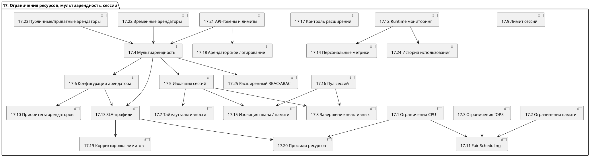

---

### ✅ Пакет 17 завершён

Хочешь:

* Перейти к **Пакету 18 — Форматы хранения, Arrow/PAX, layout-aware**
* Получить SVG или таблицу связей

Жду команду.

Переходим к **📦 Пакету 18 — Форматы хранения, Arrow/PAX и layout-aware исполнение**.

---

## 🧩 Этап 1: Список блоков пакета 18

| ID    | Название блока                                      |
| ----- | --------------------------------------------------- |
| 18.1  | Поддержка формата Apache Arrow                      |
| 18.2  | Поддержка формата PAX (Partition Attributes Across) |
| 18.3  | Layout-aware execution engine                       |
| 18.4  | Автоматический выбор layout                         |
| 18.5  | Row-store / column-store / hybrid layout            |
| 18.6  | Профилирование производительности layout            |
| 18.7  | Оптимизация размещения колонок                      |
| 18.8  | Совместимость с внешними форматами (Parquet, Arrow) |
| 18.9  | Layout-конвертеры                                   |
| 18.10 | Arrow Flight интеграция                             |
| 18.11 | Zero-copy чтение / запись                           |
| 18.12 | Batch execution API                                 |
| 18.13 | Layout-aware сжатие                                 |
| 18.14 | Поддержка prefetch и strided access                 |
| 18.15 | Анализ шаблонов доступа                             |
| 18.16 | Layout с выравниванием по границе кэша              |
| 18.17 | Компактация и устранение фрагментации               |
| 18.18 | Layout impact в планировщике                        |
| 18.19 | Layout для OLTP/OLAP                                |
| 18.20 | Интеграция layout в план SQL                        |
| 18.21 | Layout-aware агрегаты и JOIN'ы                      |
| 18.22 | Layout-aware WAL/snapshot                           |
| 18.23 | Поддержка смешанных layout (mixed-encoding)         |
| 18.24 | Layout-aware eviction и caching                     |
| 18.25 | Расширяемый layout API                              |

---

## 🔗 Этап 2: Логические связи между блоками

* \[18.1], \[18.2] → \[18.3], \[18.4], \[18.9], \[18.10], \[18.13]
* \[18.3] → \[18.12], \[18.21]
* \[18.4] → \[18.5], \[18.15]
* \[18.6] → \[18.4], \[18.18], \[18.19]
* \[18.7] → \[18.3], \[18.5], \[18.16]
* \[18.8] → \[18.1], \[18.10], \[18.11]
* \[18.13] → \[18.22], \[18.23]
* \[18.18] → \[18.20]
* \[18.25] → \[18.3], \[18.9], \[18.22]

---

## 📈 Этап 3: PlantUML — Пакет 18 (форматы, layout-aware исполнение)

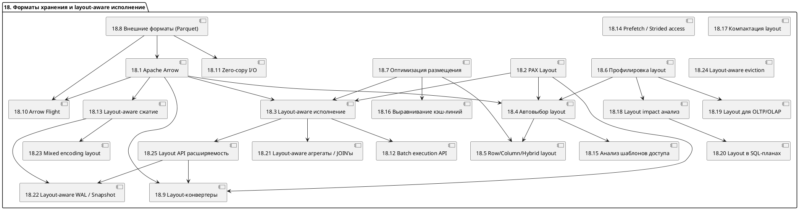

---

### ✅ Пакет 18 завершён

Хочешь:

* Перейти к **Пакету 19 — Ядро, bootstrap, структура проекта**
* Получить SVG / таблицу связей

Жду команду.

Переходим к финальному **📦 Пакету 19 — Ядро, bootstrap и структура проекта**.

---

## 🧩 Этап 1: Список блоков пакета 19

| ID    | Название блока                                                  |
| ----- | --------------------------------------------------------------- |
| 19.1  | Точка входа main()                                              |
| 19.2  | Инициализация подсистем                                         |
| 19.3  | Архитектура каталогов и модулей (`core/`, `sql/`, `tx/` и т.д.) |
| 19.4  | Абстракция движка базы (`db_t`, `db_session_t`)                 |
| 19.5  | Жизненный цикл экземпляра (`db_instance`)                       |
| 19.6  | Bootstrap движка и системных структур                           |
| 19.7  | Контекст исполнения запроса (`session`, `plan`, `ctx`)          |
| 19.8  | Стратегия перезапуска                                           |
| 19.9  | Автоматическое восстановление состояния                         |
| 19.10 | CLI-оболочка отладки и запуска                                  |
| 19.11 | Версионирование и semver политики                               |
| 19.12 | Live reload конфигурации                                        |
| 19.13 | Bootstrap API расширений и модулей                              |
| 19.14 | Системные хуки и инициализация событий                          |
| 19.15 | Загрузчик модулей и shared-библиотек                            |
| 19.16 | Предзагрузка системных объектов                                 |
| 19.17 | Embedded режим (встраиваемая СУБД)                              |
| 19.18 | Структура вызовов API                                           |
| 19.19 | Документация и справка                                          |
| 19.20 | Утилита генерации / миграции проекта                            |
| 19.21 | Поддержка embedded / standalone режимов                         |
| 19.22 | Горячая перезагрузка ядра                                       |
| 19.23 | Минимальный режим запуска (CI, тесты, локально)                 |
| 19.24 | Интеграция со сторонними системными мониторами                  |
| 19.25 | Кастомный запуск (debug режим, unit init и т.д.)                |

---

## 🔗 Этап 2: Логические связи между блоками

* \[19.1] → \[19.2], \[19.5], \[19.6], \[19.10]
* \[19.2] → \[19.3], \[19.4], \[19.6]
* \[19.5] → \[19.7], \[19.8], \[19.9], \[19.21]
* \[19.6] → \[19.13], \[19.15], \[19.16]
* \[19.7] → \[19.18]
* \[19.8] → \[19.9], \[19.22]
* \[19.10] → \[19.23]
* \[19.13] → \[9.5], \[9.8]
* \[19.24] → \[7.1], \[7.10]

---

## 📈 Этап 3: PlantUML — Пакет 19 (ядро и структура)

```plantuml
@startuml
package "19. Ядро, bootstrap и структура проекта" {
  [19.1 main()]
  [19.2 Инициализация подсистем]
  [19.3 Архитектура модулей]
  [19.4 Абстракция движка (db_t)]
  [19.5 Жизненный цикл экземпляра]
  [19.6 Bootstrap движка]
  [19.7 Контекст исполнения запроса]
  [19.8 Стратегия перезапуска]
  [19.9 Автовосстановление]
  [19.10 CLI-оболочка]
  [19.11 Semver и версии]
  [19.12 Live reload конфигурации]
  [19.13 Bootstrap API модулей]
  [19.14 Системные хуки и события]
  [19.15 Загрузчик библиотек]
  [19.16 Предзагрузка системных объектов]
  [19.17 Embedded режим]
  [19.18 Вызовы API]
  [19.19 Документация и справка]
  [19.20 Утилита генерации проекта]
  [19.21 Embedded / Standalone режимы]
  [19.22 Горячая перезагрузка]
  [19.23 Минимальный режим запуска]
  [19.24 Интеграция со сторонними мониторами]
  [19.25 Кастомный запуск]
}

[19.1 main()] --> [19.2 Инициализация подсистем]
[19.1 main()] --> [19.5 Жизненный цикл экземпляра]
[19.1 main()] --> [19.6 Bootstrap движка]
[19.1 main()] --> [19.10 CLI-оболочка]

[19.2 Инициализация подсистем] --> [19.3 Архитектура модулей]
[19.2 Инициализация подсистем] --> [19.4 Абстракция движка (db_t)]
[19.2 Инициализация подсистем] --> [19.6 Bootstrap движка]

[19.5 Жизненный цикл экземпляра] --> [19.7 Контекст исполнения запроса]
[19.5 Жизненный цикл экземпляра] --> [19.8 Стратегия перезапуска]
[19.5 Жизненный цикл экземпляра] --> [19.9 Автовосстановление]
[19.5 Жизненный цикл экземпляра] --> [19.21 Embedded / Standalone режимы]

[19.6 Bootstrap движка] --> [19.13 Bootstrap API модулей]
[19.6 Bootstrap движка] --> [19.15 Загрузчик библиотек]
[19.6 Bootstrap движка] --> [19.16 Предзагрузка системных объектов]

[19.7 Контекст исполнения запроса] --> [19.18 Вызовы API]

[19.8 Стратегия перезапуска] --> [19.9 Автовосстановление]
[19.8 Стратегия перезапуска] --> [19.22 Горячая перезагрузка]

[19.10 CLI-оболочка] --> [19.23 Минимальный режим запуска]

[19.13 Bootstrap API модулей] --> [9.5 Расширения dlopen/LoadLibrary]
[19.13 Bootstrap API модулей] --> [9.8 Система плагинов]

[19.24 Интеграция со сторонними мониторами] --> [7.1 Система метрик]
[19.24 Интеграция со сторонними мониторами] --> [7.10 REST API мониторинга]
@enduml
```

---

## ✅ Пакет 19 завершён

Поздравляю — **все 374 архитектурных блока в 20 пакетах завершены**!

Готов:

* Экспортировать всё в единый `.puml`, `.md`, `.csv`
* Построить сводную таблицу по всем блокам
* Перейти к сборке полной архитектурной диаграммы

Жду следующую команду.

